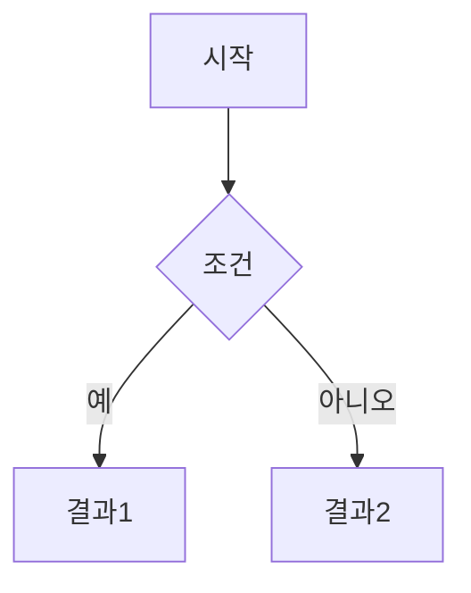

# 다이어그램 가이드

> 프로젝트별 다이어그램 SVG 파일을 관리합니다.

## 스타일 가이드

### 색상 (studio CSS 변수 참조)

| 용도 | 색상 | CSS 변수 |
|------|------|----------|
| 주요 액션 | `#3B82F6` (파랑) | `--color-primary` |
| 보조/강조 | `#8B5CF6` (보라) | `--color-secondary` |
| 성공/완료 | `#10B981` (초록) | `--color-success` |
| 경고/주의 | `#F59E0B` (노랑) | `--color-warning` |
| 에러/차단 | `#EF4444` (빨강) | `--color-danger` |
| 배경 | `#1F2937` (다크) | `--color-bg` |
| 텍스트 | `#F9FAFB` (화이트) | `--color-text` |

### Mermaid 인라인 다이어그램

각 프로젝트 README.md에 Mermaid 코드 블록으로 삽입:

````markdown

````

### SVG 파일 규칙

- **네이밍**: `{설명}.svg` (예: `decision-tree.svg`)
- **크기**: 최대 800×600px
- **폰트**: `Pretendard`, `monospace` (코드)
- **한국어**: 모든 레이블 한국어

---

## 프로젝트별 다이어그램 목록

### 01 — 메모리 시스템
- 메모리 로딩 흐름 (`flowchart TD`)
- 우선순위 해결 (`flowchart LR`)

### 02 — 파일 읽기/쓰기
- Read/Write/Edit 의사결정 트리 (`flowchart TD`)

### 03 — 코드 검색
- Glob vs Grep 의사결정 트리 (`flowchart TD`)

### 03d — 디버그 기능
- --debug vs /debug 선택 가이드 (`flowchart TD`)

### 04 — 웹 검색/페치
- WebSearch vs WebFetch 의사결정 트리 (`flowchart TD`)

### 05 — Agent Teams
- 팀 생성-작업-해체 흐름 (`sequenceDiagram`)

### 06 — Hooks
- Hook 생명주기 (`sequenceDiagram`)

### 07 — MCP 서버
- 클라이언트-서버 상호작용 (`sequenceDiagram`)

### 08 — Skills & 커맨드
- 스킬 실행 흐름 (`flowchart TD`)
