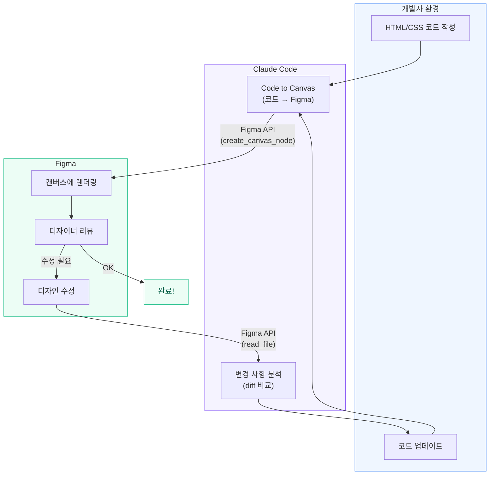
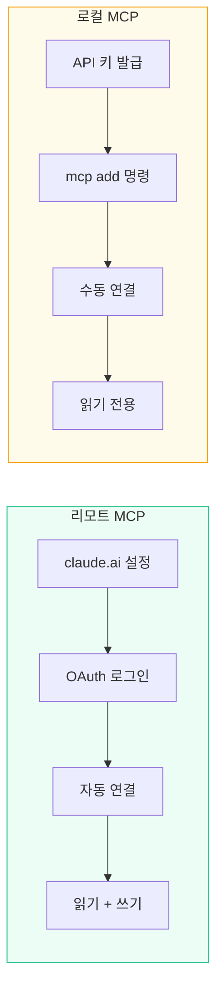
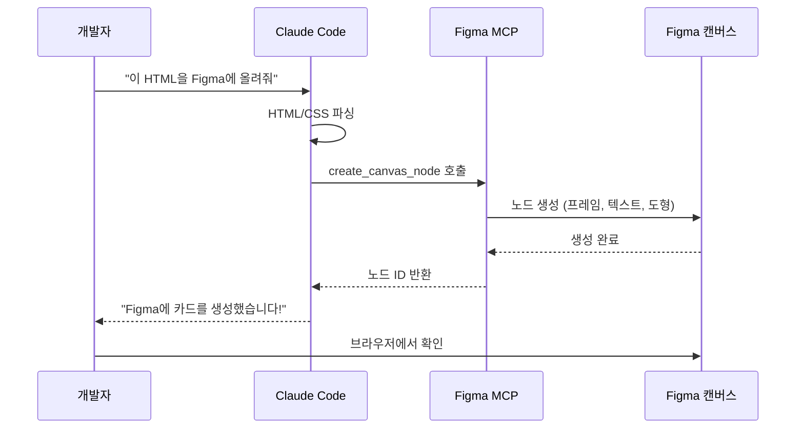

# Figma MCP 라운드트립 플로우

> 12-figma-mcp 프로젝트의 핵심 워크플로우 다이어그램

## 전체 라운드트립 플로우

```mermaid
flowchart TD
    subgraph DEV["개발자 환경"]
        A["HTML/CSS 코드 작성"]
        G["코드 업데이트"]
    end

    subgraph CLAUDE["Claude Code"]
        B["Code to Canvas\n(코드 → Figma)"]
        F["변경 사항 분석\n(diff 비교)"]
    end

    subgraph FIGMA["Figma"]
        C["캔버스에 렌더링"]
        D["디자이너 리뷰"]
        E["디자인 수정"]
    end

    A --> B
    B -->|"Figma API\n(create_canvas_node)"| C
    C --> D
    D -->|"OK"| H["완료!"]
    D -->|"수정 필요"| E
    E -->|"Figma API\n(read_file)"| F
    F --> G
    G --> B

    style DEV fill:#EFF6FF,stroke:#3B82F6
    style CLAUDE fill:#F5F3FF,stroke:#8B5CF6
    style FIGMA fill:#ECFDF5,stroke:#10B981
    style H fill:#ECFDF5,stroke:#10B981,color:#065F46
```

## MCP 연결 방식 비교

```mermaid
flowchart LR
    subgraph REMOTE["리모트 MCP"]
        R1["claude.ai 설정"] --> R2["OAuth 로그인"]
        R2 --> R3["자동 연결"]
        R3 --> R4["읽기 + 쓰기"]
    end

    subgraph LOCAL["로컬 MCP"]
        L1["API 키 발급"] --> L2["mcp add 명령"]
        L2 --> L3["수동 연결"]
        L3 --> L4["읽기 전용"]
    end

    style REMOTE fill:#ECFDF5,stroke:#10B981
    style LOCAL fill:#FFFBEB,stroke:#F59E0B
```

## Code to Canvas 프로세스

```mermaid
sequenceDiagram
    participant Dev as 개발자
    participant CC as Claude Code
    participant API as Figma MCP
    participant Fig as Figma 캔버스

    Dev->>CC: "이 HTML을 Figma에 올려줘"
    CC->>CC: HTML/CSS 파싱
    CC->>API: create_canvas_node 호출
    API->>Fig: 노드 생성 (프레임, 텍스트, 도형)
    Fig-->>API: 생성 완료
    API-->>CC: 노드 ID 반환
    CC-->>Dev: "Figma에 카드를 생성했습니다!"
    Dev->>Fig: 브라우저에서 확인
```
