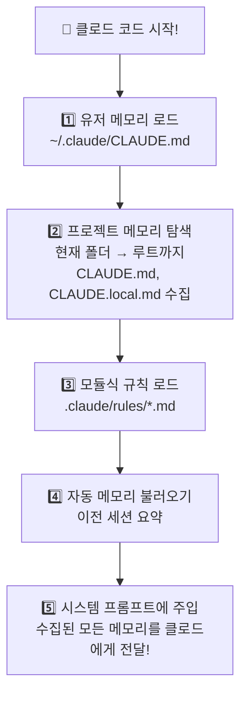

# 클로드 코드 메모리 시스템 ⭐~⭐⭐⭐

> 클로드 코드가 어떻게 "기억"하는지 알아보자!

## 메모리 시스템이란?

클로드 코드는 대화가 끝나면 내용을 잊어버립니다. 하지만 **메모리 시스템**을 사용하면 중요한 정보를 기억하게 만들 수 있어요.

예를 들어:
- "이 프로젝트에서는 항상 한국어로 답해줘"
- "코드 스타일은 이렇게 해줘"
- "이 프로젝트의 구조는 이래"

이런 것들을 매번 말하지 않아도, **파일에 적어두면** 클로드가 자동으로 읽어서 기억합니다.

---

## 전체 구조도

클로드 코드의 메모리는 크게 3가지로 나뉩니다:

```
메모리 시스템 (전체)
│
├── 📝 수동 메모리 (내가 직접 쓰는 것)
│   ├── CLAUDE.md           ← 프로젝트 규칙/컨텍스트 (팀 공유)
│   ├── CLAUDE.local.md     ← 개인용 설정 (나만 사용, git 제외)
│   ├── ~/.claude/CLAUDE.md ← 모든 프로젝트에 적용되는 공통 규칙
│   └── .claude/rules/*.md  ← 규칙을 파일별로 나누어 관리
│
├── 🤖 자동 메모리 (클로드가 알아서 쓰는 것)
│   └── 세션 메모리 요약     ← 대화 내용을 자동 저장/불러오기
│
└── 🧠 에이전트 메모리 (서브에이전트가 쓰는 것)
    └── MEMORY.md            ← 에이전트별 학습 기록
```

---

## 메모리 5가지 유형 비교

| 유형 | 누가 쓰나 | 어디에 저장 | 공유 범위 | 핵심 용도 |
|------|-----------|------------|-----------|-----------|
| **프로젝트 메모리** | 개발자 (나) | `./CLAUDE.md` | 팀 전체 (git에 포함) | 프로젝트 규칙, 코드 컨벤션 |
| **로컬 메모리** | 개발자 (나) | `./CLAUDE.local.md` | 나만 (git 제외) | 개인 설정, 로컬 URL |
| **유저 메모리** | 개발자 (나) | `~/.claude/CLAUDE.md` | 나만 (모든 프로젝트) | 개인 스타일, 선호 설정 |
| **자동 메모리** | 클로드 | `~/.claude/projects/...` | 자동 | 세션 컨텍스트 기억 |
| **에이전트 메모리** | 서브에이전트 | `.claude/agent-memory/` | 설정에 따라 | 에이전트 학습 축적 |

### 쉽게 비유하면

- **프로젝트 메모리** = 교실 게시판 (모두가 봄)
- **로컬 메모리** = 내 서랍 속 메모 (나만 봄)
- **유저 메모리** = 항상 들고 다니는 수첩 (어디서든 적용)
- **자동 메모리** = 클로드의 일기장 (알아서 기록)
- **에이전트 메모리** = 조수의 업무 노트 (작업하면서 배운 것)

---

## 메모리 로딩 흐름

클로드 코드를 시작하면, 이런 순서로 메모리를 읽어옵니다:



### 우선순위 규칙

같은 내용이 여러 곳에 있으면? **가까운 것이 우선**입니다.


> 💡 가까운 설정이 먼 설정을 덮어씁니다!

---

## 주요 커맨드

| 커맨드 | 설명 | 사용 예시 |
|--------|------|-----------|
| `/init` | CLAUDE.md 자동 생성 | 새 프로젝트 시작할 때 |
| `/memory` | 메모리 파일을 에디터로 열기 | 규칙 수정할 때 |

---

## 예제 프로젝트

이 폴더에는 단계별로 따라할 수 있는 예제가 있습니다:

| # | 예제 | 난이도 | 설명 |
|---|------|--------|------|
| 1 | [CLAUDE.md 만들기](examples/basic-claudemd/) | ⭐ | CLAUDE.md의 효과를 직접 확인 |
| 2 | [메모리 계층 구조](examples/memory-hierarchy/) | ⭐⭐ | 여러 메모리의 우선순위 이해 |
| 3 | [에이전트 메모리](examples/agent-memory/) | ⭐⭐⭐ | 서브에이전트의 학습 메모리 |

추가 가이드:
- [자동 메모리 관찰 가이드](auto-memory-guide.md) — 클로드가 알아서 저장하는 메모리 살펴보기

---

## 더 알아보기

- [클로드 코드 공식 문서](https://docs.anthropic.com/en/docs/claude-code)
- 이 프로젝트의 CLAUDE.md도 메모리 시스템의 일부입니다! `../../CLAUDE.md`를 확인해보세요.
