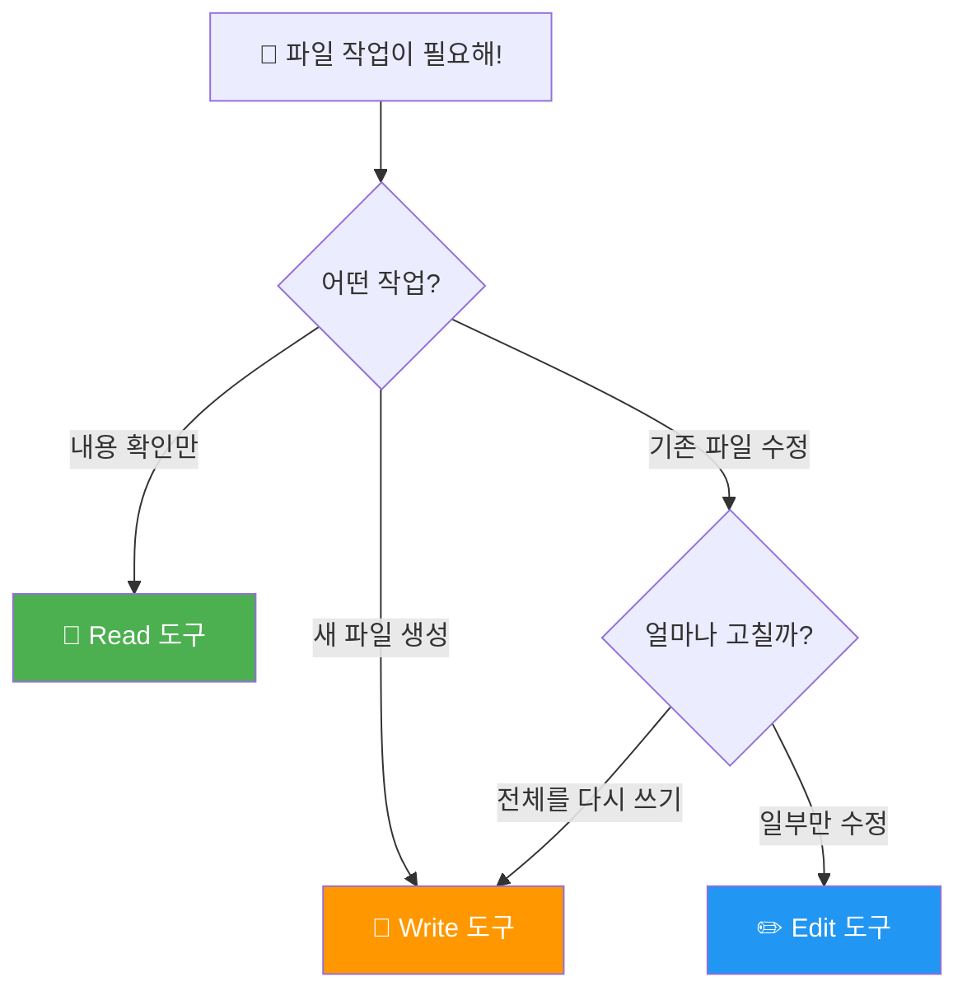

# 파일 읽기/쓰기 ⭐

> 클로드가 파일을 직접 읽고, 만들고, 고칠 수 있다고? 🤯

## 이게 왜 중요할까?

프로그래밍에서 **파일 다루기**는 가장 기본적이면서도 중요한 작업이에요.
클로드 코드는 3가지 전용 도구로 파일을 자유자재로 다룰 수 있습니다.

---

## 핵심 비유: 도서관 사서 📚

클로드 코드의 파일 도구를 **도서관 사서**에 비유하면 이해가 쉬워요:

| 도구 | 사서가 하는 일 | 비유 |
|------|---------------|------|
| **Read** | 📖 책을 꺼내서 읽어주기 | "이 책 3페이지 읽어주세요" |
| **Write** | 📝 새 책을 만들어서 서가에 꽂기 | "새 책 만들어주세요" (같은 제목이면 통째로 교체!) |
| **Edit** | ✏️ 책의 오탈자만 살짝 고치기 | "52쪽에 '사과'를 '바나나'로 바꿔주세요" |

---

## 3도구 한눈에 비교 🔍

| | Read | Write | Edit |
|---|---|---|---|
| **하는 일** | 파일 내용 읽기 | 파일 새로 만들기 / 덮어쓰기 | 파일 일부분만 수정 |
| **위험도** | ✅ 안전 (읽기만!) | ⚠️ 주의 (기존 내용 사라짐!) | ✅ 비교적 안전 |
| **비유** | 책 읽기 | 책 통째로 교체 | 오탈자 수정 |
| **되돌리기** | 필요 없음 | ❌ 어려움 | 가능 |

### ⚠️ Write vs Edit — 가장 중요한 차이!

```
Write = 통째로 교체! 📦➡️📦
  기존 파일이 있으면 → 내용이 전부 사라지고 새 내용으로!
  마치 노트 전체를 새 노트로 바꾸는 것

Edit = 부분만 수정! ✏️
  old_string → new_string
  노트에서 한 줄만 지우개로 지우고 다시 쓰는 것
```

💡 **팁:** "파일 전체를 새로 쓸 때는 Write, 일부만 고칠 때는 Edit!"

---

## 도구 선택 가이드 🗺️

어떤 도구를 써야 할지 모르겠다면 이 순서도를 따라가세요:



---

## 각 도구 파라미터 정리 📋

### Read (읽기)

| 파라미터 | 필수 | 설명 | 예시 |
|----------|------|------|------|
| `file_path` | ✅ 필수 | 읽을 파일의 절대 경로 | `/Users/me/project/app.js` |
| `limit` | 선택 | 읽을 줄 수 제한 | `10` (처음 10줄만) |
| `offset` | 선택 | 시작할 줄 번호 | `5` (5번째 줄부터) |

💡 `limit`과 `offset`을 조합하면 파일의 원하는 부분만 읽을 수 있어요!

### Write (쓰기)

| 파라미터 | 필수 | 설명 | 예시 |
|----------|------|------|------|
| `file_path` | ✅ 필수 | 만들/덮어쓸 파일 경로 | `/Users/me/project/new.txt` |
| `content` | ✅ 필수 | 파일에 쓸 내용 | `"Hello World!"` |

⚠️ **주의:** 같은 이름의 파일이 이미 있으면 **통째로 덮어쓰기**됩니다!

### Edit (수정)

| 파라미터 | 필수 | 설명 | 예시 |
|----------|------|------|------|
| `file_path` | ✅ 필수 | 수정할 파일 경로 | `/Users/me/project/app.js` |
| `old_string` | ✅ 필수 | 바꿀 원래 문자열 | `"사과"` |
| `new_string` | ✅ 필수 | 바꿀 새 문자열 | `"바나나"` |
| `replace_all` | 선택 | 모든 일치 항목 교체 | `true` (기본값: `false`) |

⚠️ **핵심 규칙:** `old_string`은 파일 안에서 **유일해야** 합니다!
만약 같은 문자열이 여러 군데 있으면 → 더 많은 주변 텍스트를 포함해서 유일하게 만들거나, `replace_all: true` 사용!

---

## 예제 프로젝트 📂

단계별로 따라할 수 있는 예제들이 준비되어 있어요:

| # | 예제 | 난이도 | 배울 내용 |
|---|------|--------|-----------|
| 1 | [파일 읽기 기초](examples/read-basics/) | ⭐ | Read 도구로 다양한 파일 읽기 |
| 2 | [파일 만들기](examples/write-create/) | ⭐ | Write 도구로 새 파일 생성하기 |
| 3 | [파일 수정하기](examples/edit-modify/) | ⭐⭐ | Edit 도구로 코드 버그 고치기 |

---

## 핵심 정리 ✨

```
✅ Read  — 파일을 읽기만 (안전!)
✅ Write — 파일을 새로 만들기 (덮어쓰기 주의!)
✅ Edit  — 파일 일부만 수정 (old_string은 유일해야!)

🎯 기억할 것:
  1. Read는 항상 안전 — 마음껏 사용!
  2. Write는 기존 내용을 지움 — 새 파일에만 사용 권장
  3. Edit의 old_string은 유일해야 함 — 안 되면 주변 텍스트 더 포함!
```

---

## 더 알아보기 🔗

- 다음 프로젝트: [코드 검색 (Glob/Grep)](../03-code-search/) — 파일 찾기와 내용 검색
- [클로드 코드 공식 문서](https://docs.anthropic.com/en/docs/claude-code)
