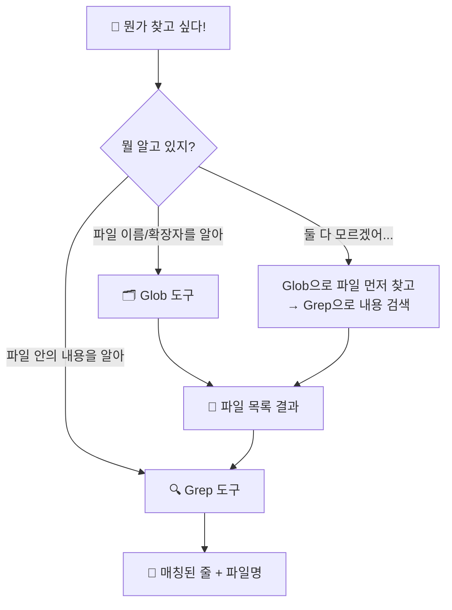

# 코드 검색 ⭐

> 🤔 10,000줄짜리 프로젝트에서 원하는 코드를 어떻게 찾을까?

프로그램이 커지면 파일이 수십, 수백 개가 됩니다. 이때 "저 함수 어디 있었지?", "TODO 남긴 곳이 어디더라?" 하고 일일이 파일을 열어보면... 하루가 다 갑니다 😱

클로드 코드에는 **두 가지 강력한 검색 도구**가 있습니다!

---

## 🎯 핵심 비유: 도서관에서 책 찾기

도서관에 갔다고 상상해보세요. 책을 찾는 방법이 두 가지 있습니다:

| 방법 | 도서관 | 클로드 코드 |
|------|--------|-------------|
| **제목/위치로 찾기** | 📋 카탈로그에서 "수학" 코너 3번 선반 | **Glob** — 파일 이름이나 경로로 찾기 |
| **내용으로 찾기** | 🔍 검색 엔진에 "피타고라스" 입력 | **Grep** — 파일 안의 내용으로 찾기 |

### 한 줄 요약

- **Glob** = "이런 **이름**의 파일 어디 있어?" 📋
- **Grep** = "이 **단어**가 들어간 파일은?" 🔍

---

## 📊 Glob vs Grep 비교표

| 구분 | Glob 🗂️ | Grep 🔍 |
|------|----------|---------|
| **비유** | 도서관 카탈로그 | 전문 검색 엔진 |
| **검색 대상** | 파일 이름 / 경로 | 파일 내용 (텍스트) |
| **질문 예시** | "*.js 파일 찾아줘" | "TODO가 있는 줄 찾아줘" |
| **결과** | 파일 경로 목록 | 매칭된 줄 + 파일명 |
| **속도** | ⚡ 매우 빠름 | ⚡ 빠름 |
| **언제 쓸까** | 파일 위치를 모를 때 | 코드 내용을 찾을 때 |

---

## 🗺️ 어떤 도구를 쓸까? 판단 플로우차트



> 💡 **팁:** 잘 모르겠으면 **Glob → Grep** 순서로 쓰면 됩니다! (깔때기 전략)

---

## 📁 연습용 프로젝트 소개

이 튜토리얼에는 `playground/` 폴더에 **가상 웹 프로젝트**가 들어있습니다.

```
playground/
├── src/
│   ├── app.js              # 🚀 메인 서버 (Express)
│   ├── utils.js            # 🛠️ 유틸리티 함수들
│   ├── config.json         # ⚙️ 설정 파일
│   └── components/
│       ├── Header.js       # 📌 헤더 컴포넌트
│       ├── Footer.js       # 📌 푸터 컴포넌트
│       └── TodoItem.js     # 📌 할일 컴포넌트
├── tests/
│   ├── app.test.js         # 🧪 앱 테스트
│   └── utils.test.js       # 🧪 유틸 테스트
├── docs/
│   ├── guide.md            # 📖 사용자 가이드
│   └── api.md              # 📖 API 문서
├── styles/
│   ├── main.css            # 🎨 메인 스타일
│   └── components.css      # 🎨 컴포넌트 스타일
└── package.json            # 📦 프로젝트 정보
```

이 파일들을 대상으로 Glob과 Grep을 연습해볼 거예요!

---

## 📚 학습 순서

| 순서 | 주제 | 폴더 | 배울 내용 |
|------|------|------|-----------|
| 1️⃣ | Glob 패턴 | `examples/glob-patterns/` | 와일드카드 `*`, `**`, `?`, `{}` |
| 2️⃣ | Grep 검색 | `examples/grep-search/` | 내용 검색, 출력 모드, 컨텍스트 |
| 3️⃣ | 콤보 전략 | `examples/combined/` | 깔때기 전략 + 실전 미션 3개 |

---

## 🚀 바로 시작하기

### 1단계: Glob으로 파일 찾기

클로드 코드에게 이렇게 말해보세요:

```
playground 폴더에서 모든 JavaScript 파일을 찾아줘
```

클로드는 내부적으로 이렇게 검색합니다:

```
Glob: pattern="**/*.js" path="playground/"
```

**결과:**
```
playground/src/app.js
playground/src/utils.js
playground/src/components/Header.js
playground/src/components/Footer.js
playground/src/components/TodoItem.js
playground/tests/app.test.js
playground/tests/utils.test.js
```

7개 파일을 한 번에 찾았습니다! 📋

### 2단계: Grep으로 내용 검색

```
playground 폴더에서 TODO 주석을 모두 찾아줘
```

클로드는 내부적으로 이렇게 검색합니다:

```
Grep: pattern="TODO" path="playground/"
```

**결과:**
```
playground/src/app.js:    // TODO: add authentication
playground/src/app.js:    // TODO: add error handling
playground/src/utils.js:  // TODO: add timezone support
playground/src/components/TodoItem.js: // TODO: add drag and drop
playground/tests/app.test.js: // TODO: add integration tests
playground/docs/guide.md: <!-- TODO: add screenshots -->
```

여러 파일에 흩어진 TODO를 한 번에 찾았습니다! 🔍

### 3단계: 콤보! Glob → Grep

```
playground에서 컴포넌트 파일들만 찾아서, 그 중에 export가 있는 것을 보여줘
```

1. **Glob**으로 컴포넌트 파일 찾기: `**/components/*.js`
2. **Grep**으로 `export` 검색

이게 바로 **깔때기 전략**입니다! 🔄

---

## 💡 핵심 정리

```
┌─────────────────────────────────────────────┐
│                                             │
│  🗂️ Glob = 파일 이름으로 찾기              │
│     "이런 이름의 파일 어디 있어?"           │
│                                             │
│  🔍 Grep = 파일 내용으로 찾기              │
│     "이 단어가 들어간 파일은?"              │
│                                             │
│  🔄 깔때기 = Glob 먼저 → Grep 나중에       │
│     "범위를 좁히고 → 정확히 찾기"           │
│                                             │
└─────────────────────────────────────────────┘
```

> ✅ 이제 `examples/` 폴더에서 하나씩 자세히 배워볼까요?

---

## 🔗 다음 단계

- 📂 [Glob 패턴 배우기](examples/glob-patterns/README.md) — 와일드카드 마스터하기
- 🔍 [Grep 검색 배우기](examples/grep-search/README.md) — 내용 검색의 모든 것
- 🎯 [콤보 전략 + 미션](examples/combined/README.md) — 실전 연습!
