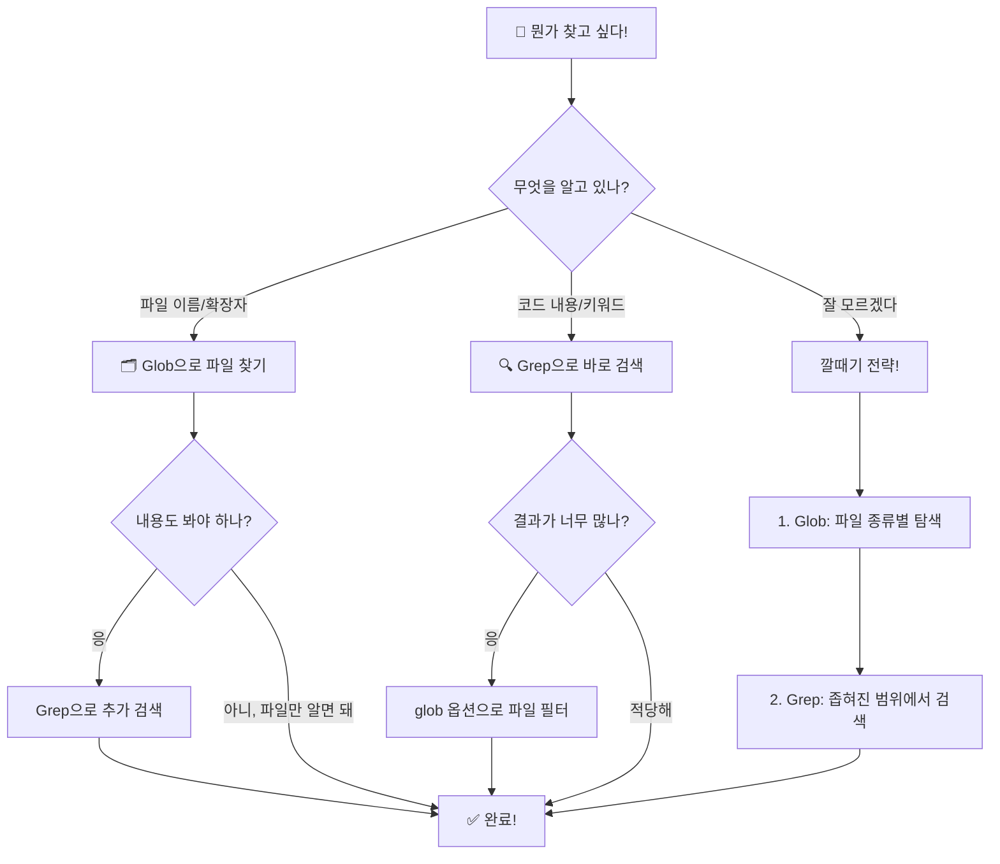

# 콤보 전략 + 실전 미션 🎯

> 🔄 Glob과 Grep을 조합하면 무엇이든 찾을 수 있다!

지금까지 배운 두 도구를 합쳐봅시다. 실전에서는 한 가지 도구만 쓰는 일이 거의 없어요. **두 도구를 조합**하는 게 핵심입니다!

---

## 🔄 깔때기 전략이란?

물을 깔때기에 부으면 위에서 넓게 들어가서 아래로 좁아지죠?
검색도 마찬가지입니다!

```
         ┌─────────────────────────────────┐
  넓게   │  1단계: Glob으로 파일 범위 좁히기  │   🗂️
         │  "어떤 종류의 파일을 볼까?"        │
         └──────────┬──────────────────────┘
                    │
                    ▼
         ┌─────────────────────────────────┐
  좁게   │  2단계: Grep으로 내용 검색하기     │   🔍
         │  "그 파일들에서 뭘 찾을까?"        │
         └──────────┬──────────────────────┘
                    │
                    ▼
              ✅ 정확한 결과!
```

### 예시: "컴포넌트에서 export하는 함수 찾기"

**1단계 — Glob으로 범위 좁히기:**
```
Glob: pattern="**/components/*.js" path="playground/"
```
→ Header.js, Footer.js, TodoItem.js (3개 파일)

**2단계 — Grep으로 내용 검색:**
```
Grep: pattern="module.exports" path="playground/src/components/" output_mode="content"
```
→ 각 컴포넌트가 뭘 내보내는지 정확히 확인!

> 💡 만약 처음부터 Grep만 썼다면 모든 파일에서 검색해서 노이즈가 많았을 거예요. 깔때기로 좁히면 깔끔!

---

## 🎯 실전 미션 3개

playground 프로젝트를 대상으로 도전해보세요!

---

### 미션 1: 📋 모든 TODO 찾아 정리하기

**배경:** 프로젝트를 인수인계 받았는데, 전임자가 남긴 TODO가 여기저기 있다고 합니다. 전부 찾아서 정리해야 해요!

**목표:** playground에서 모든 TODO 주석을 찾아 정리표 만들기

<details>
<summary>🔑 힌트</summary>

TODO를 찾는 건 **내용 검색**이니까 Grep!
</details>

<details>
<summary>✅ 풀이</summary>

**클로드에게 이렇게 말해보세요:**
```
playground 폴더에서 모든 TODO 주석을 찾아서 표로 정리해줘
```

**클로드가 사용하는 도구:**
```
Grep: pattern="TODO" path="playground/" output_mode="content"
```

**정리 결과:**

| 파일 | 줄 | TODO 내용 |
|------|-----|----------|
| `src/app.js` | 14 | add authentication middleware |
| `src/app.js` | 65 | add error handling for invalid data types |
| `src/utils.js` | 14 | add timezone support |
| `src/components/Footer.js` | 6 | add social media links |
| `src/components/TodoItem.js` | 5 | add drag and drop support |
| `tests/app.test.js` | 3 | add integration tests for error cases |
| `docs/guide.md` | 5 | add screenshots |

**총 7개의 TODO**를 찾았습니다!

우선순위를 매기면:
1. 🔴 `authentication` — 보안 관련, 긴급
2. 🟡 `error handling` — 안정성 관련
3. 🟢 나머지 — 기능 개선
</details>

---

### 미션 2: 📦 모든 공개 함수 찾기

**배경:** 프로젝트의 API 문서를 만들려고 합니다. 어떤 함수들이 외부에 공개(export)되어 있는지 알아야 해요.

**목표:** `src/` 폴더에서 export되는 모든 함수 목록 만들기

<details>
<summary>🔑 힌트</summary>

1. 먼저 Glob으로 `src/` 안의 JS 파일을 확인
2. 그 다음 Grep으로 `module.exports`를 검색
</details>

<details>
<summary>✅ 풀이</summary>

**1단계 — 소스 파일 확인 (Glob):**
```
Glob: pattern="**/*.js" path="playground/src/"
```

결과:
```
playground/src/app.js
playground/src/utils.js
playground/src/components/Header.js
playground/src/components/Footer.js
playground/src/components/TodoItem.js
```

**2단계 — export 검색 (Grep):**
```
Grep: pattern="module.exports" path="playground/src/" output_mode="content" -A=3
```

결과 (아래 3줄도 함께):
```
playground/src/app.js:
  module.exports = app;

playground/src/utils.js:
  module.exports = {
    formatDate,
    generateId,
    validateEmail,
  };

playground/src/components/Header.js:
  module.exports = { Header };

playground/src/components/Footer.js:
  module.exports = { Footer };

playground/src/components/TodoItem.js:
  module.exports = { TodoItem, TodoList };
```

**공개 함수/모듈 정리:**

| 파일 | 공개 항목 | 종류 |
|------|----------|------|
| `app.js` | `app` | Express 앱 인스턴스 |
| `utils.js` | `formatDate`, `generateId`, `validateEmail` | 유틸리티 함수 |
| `Header.js` | `Header` | 컴포넌트 |
| `Footer.js` | `Footer` | 컴포넌트 |
| `TodoItem.js` | `TodoItem`, `TodoList` | 컴포넌트 |

총 **8개 항목**이 공개되어 있습니다!
</details>

---

### 미션 3: 🔒 보안 취약점 찾기

**배경:** 보안 감사를 해야 합니다. 코드에 하드코딩된 비밀 정보(API 키, 비밀번호 등)가 없는지 확인해야 해요.

**목표:** 설정 파일에서 보안 취약점 찾기

<details>
<summary>🔑 힌트</summary>

1. Glob으로 설정 파일 찾기 (`.json`, `.env` 등)
2. Grep으로 "KEY", "SECRET", "PASSWORD" 같은 키워드 검색
</details>

<details>
<summary>✅ 풀이</summary>

**1단계 — 설정 파일 찾기 (Glob):**
```
Glob: pattern="**/*.{json,env}" path="playground/"
```

결과:
```
playground/src/config.json
playground/package.json
```

**2단계 — 민감한 키워드 검색 (Grep):**
```
Grep: pattern="KEY|SECRET|PASSWORD|TOKEN" path="playground/" output_mode="content" -i=true
```

결과:
```
playground/src/config.json:  "apiKey": "YOUR_API_KEY_HERE",
```

**🚨 발견된 취약점:**

| 파일 | 문제 | 위험도 |
|------|------|--------|
| `src/config.json` | API 키가 하드코딩됨 | 🔴 높음 |

**해결 방법:**
1. `.env` 파일로 분리: `API_KEY=실제키값`
2. `config.json`에서는 환경변수 참조: `process.env.API_KEY`
3. `.env`는 `.gitignore`에 추가하여 git에 올라가지 않게!

> 실제 프로젝트에서 API 키가 코드에 하드코딩되면 git에 올라가서 외부에 노출될 수 있어요. 매우 위험합니다! 🔒
</details>

---

## 🗺️ 검색 전략 정리 플로우차트



---

## 💡 핵심 정리

```
┌───────────────────────────────────────────────┐
│ 🔄 깔때기 전략                                │
│                                               │
│ 1단계: Glob으로 범위 좁히기 (어떤 파일?)      │
│ 2단계: Grep으로 내용 찾기 (어떤 내용?)        │
│                                               │
│ 🎯 실전 포인트                                │
│                                               │
│ • TODO 관리 → Grep으로 한 방에 수집           │
│ • API 문서화 → export 키워드로 함수 목록      │
│ • 보안 감사 → 설정 파일 + 민감 키워드 조합    │
│                                               │
│ ✨ "모르겠으면 Glob 먼저 → Grep 나중에"       │
└───────────────────────────────────────────────┘
```

> ✅ 축하합니다! 🎉 Glob과 Grep을 마스터했습니다!
>
> 🔗 돌아가기: [메인 README](../../README.md)
