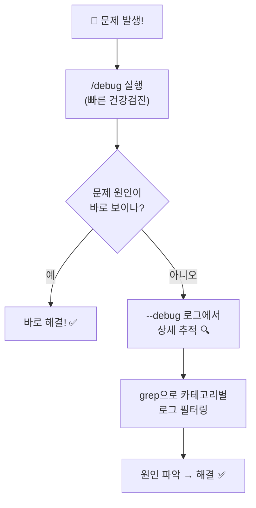

# 클로드 코드 디버그 기능 가이드 ⭐⭐

> 클로드 코드가 내부에서 뭘 하는지 들여다보자!

## 디버그 기능이 뭔가요?

클로드 코드는 겉으로 보면 "대화창"이지만, 안에서는 엄청 많은 일이 벌어집니다:
- API 호출, 도구 실행, 파일 읽기, 권한 확인...

**디버그 기능**은 이 내부 동작을 볼 수 있게 해주는 도구입니다.

클로드 코드에는 디버그 관련 기능이 **2가지** 있습니다:

```
디버그 기능
│
├── 🔍 --debug 플래그     ← 블랙박스 (모든 걸 기록)
│   "세션 시작할 때 켜는 녹화 카메라"
│
└── 📊 /debug 커맨드      ← 계기판 (지금 상태 요약)
    "세션 중간에 보는 자동차 계기판"
```

---

## 한눈에 비교

| 구분 | `--debug` 플래그 | `/debug` 커맨드 |
|------|-----------------|----------------|
| **실행 방법** | `claude --debug` (세션 시작 시) | 세션 안에서 `/debug` 입력 |
| **목적** | 내부 동작 **전체 기록** | 현재 세션 **요약 진단** |
| **출력 위치** | `~/.claude/debug/` 파일 | 화면에 바로 출력 |
| **내용** | 타임스탬프별 상세 로그 (수백~수천 줄) | 로그 끝부분 + 에러/경고 안내 |
| **비유** | 자동차 블랙박스 | 자동차 계기판 |
| **사용 시점** | "왜 느리지?", "어디서 에러?" | "지금 세션 괜찮나?" |

---

## 1. `--debug` 플래그 (블랙박스)

### 기본 사용법

```bash
# 전체 로그 켜기
claude --debug

# 특정 카테고리만 보기
claude --debug "api"
claude --debug "api,hooks"

# 특정 카테고리 빼고 보기
claude --debug "!render,!file"

# 로그를 특정 파일에 저장
claude --debug-file ./my-debug.txt
```

### 로그는 어디에?

```
~/.claude/debug/
├── latest              ← 최근 세션 바로가기 (symlink)
├── abc123-def456.txt   ← 세션별 로그 파일 (UUID 이름)
├── 789ghi-012jkl.txt
└── ...                 ← 세션마다 하나씩 쌓임
```

### 로그 형식

한 줄 한 줄이 이렇게 생겼습니다:

```
2026-02-06T17:00:26.999Z [DEBUG] [API:request] Creating client
│                        │       │              │
│                        │       │              └── 메시지 (뭘 했는지)
│                        │       └── 카테고리 (어느 부분인지)
│                        └── 로그 레벨 (DEBUG / WARN / ERROR)
└── 타임스탬프 (밀리초 단위로 정확)
```

### 로그 레벨

| 레벨 | 의미 | 예시 |
|------|------|------|
| `[DEBUG]` | 일반 동작 기록 | `[init] configureGlobalMTLS starting` |
| `[WARN]` | 경고 (동작은 함) | `Failed to parse YAML frontmatter` |
| `[ERROR]` | 에러 + 스택트레이스 | `Tool Teammate not found` |

### 주요 카테고리

클로드 코드 내부는 이런 모듈로 나뉘어 있습니다:

```
카테고리               무슨 일을 하는 곳?
─────────────────────────────────────────────
[init]                 시작 초기화 (MTLS, 에이전트)
[STARTUP]              세션 전체 시작 흐름
[API:request]          Anthropic API 호출
[API:auth]             OAuth 인증 확인
[ToolSearch:optimistic] 도구 검색 최적화
[BackendRegistry]      백엔드 프로세스 관리
[render]               터미널 UI 렌더링
[keybindings]          키보드 단축키
[LSP MANAGER]          Language Server Protocol
[TeammateMailbox]      팀 에이전트 통신
[Claude in Chrome]     크롬 확장 연동
[Speculation]          응답 예측/프리페치
[Perfetto]             성능 추적
```

### 따라하기: 로그 분석

```bash
# 1. 디버그 모드로 세션 실행
claude --debug

# 2. 세션 안에서 작업 수행 (파일 읽기, 코드 수정 등)

# 3. 세션 종료 후, 로그 확인
cat ~/.claude/debug/latest | head -30        # 처음 30줄 보기
grep "\[ERROR\]" ~/.claude/debug/latest      # 에러만 보기
grep "\[WARN\]" ~/.claude/debug/latest       # 경고만 보기
grep "\[API:request\]" ~/.claude/debug/latest # API 호출만 보기
```

### 실제 로그 예시 (세션 초기화)

```
17:00:26.333  [init] MTLS/Agent 설정 .............. 0ms
17:00:26.337  권한 규칙 로드 (allow 9개, deny 11개)
17:00:26.342  [STARTUP] setup() ................... 4ms
17:00:26.346  커맨드/에이전트 로드 시작
17:00:26.380  커맨드 로드 완료 .................... 34ms
              → 플러그인 5개, 스킬 4개, 커맨드 30개
17:00:26.999  [API:request] 클라이언트 생성
17:00:27.015  [API:auth] OAuth 토큰 확인 완료
17:00:27.025  LSP 서버 0개로 초기화 완료
```

> 세션이 시작되는 700ms 동안 이만큼 많은 일이 일어납니다!

---

## 2. `/debug` 커맨드 (계기판)

### 사용법

세션 안에서 그냥 입력하면 됩니다:

```
> /debug
```

### 보여주는 것

```
# Debug Skill

## Session Debug Log
경로: ~/.claude/debug/{세션ID}.txt
총 줄 수: 955

### Last 20 lines
(최근 로그 20줄 자동 표시)

## Issue Description
에러, 경고, 주목할 문제 요약
```

### 언제 쓰면 좋을까?

| 상황 | `/debug` 사용 |
|------|--------------|
| "클로드가 갑자기 느려졌어" | 토큰 사용량, 캐시 브레이크 확인 |
| "도구 실행이 안 돼" | 도구 거부/에러 기록 확인 |
| "뭔가 이상한데 뭔지 모르겠어" | 최근 에러/경고 한눈에 확인 |

---

## 두 기능의 보완 관계



쉽게 말하면:
- **`/debug`** = "문제가 있나?" 확인하는 건강검진
- **`--debug`** = "원인이 뭔지" 추적하는 정밀검사

---

## 실전 체험: debug-test 프로젝트

이 저장소의 `debug-test/` 폴더에 의도적 버그가 있는 할인 계산기가 준비되어 있습니다.

### 체험 순서

```bash
# 1. 디버그 모드로 세션 시작
cd debug-test
claude --debug

# 2. 세션 안에서 테스트 실행 요청
> npm test 실행해줘

# 3. 세션 안에서 /debug 실행 → 세션 상태 확인
> /debug

# 4. 세션 종료 후 상세 로그 분석
grep "\[ERROR\]" ~/.claude/debug/latest
grep "tool" ~/.claude/debug/latest | head -20
```

---

## 부록: 디버그 관련 전체 옵션

| 옵션 | 설명 |
|------|------|
| `--debug` | 전체 카테고리 로깅 켜기 |
| `--debug "카테고리"` | 특정 카테고리만 (`"api,hooks"`) |
| `--debug "!카테고리"` | 특정 카테고리 제외 (`"!render"`) |
| `--debug-file <경로>` | 로그를 지정 파일에 저장 |
| `--debug-to-stderr` | 로그를 stderr로 출력 (숨겨진 옵션) |
| `/debug` | 세션 내 진단 커맨드 |

---

## 더 알아보기

- [클로드 코드 공식 문서](https://docs.anthropic.com/en/docs/claude-code)
- [클로드 코드 체인지로그](https://github.com/anthropics/claude-code/blob/main/CHANGELOG.md) — `/debug`는 v2.1.30에서 추가
