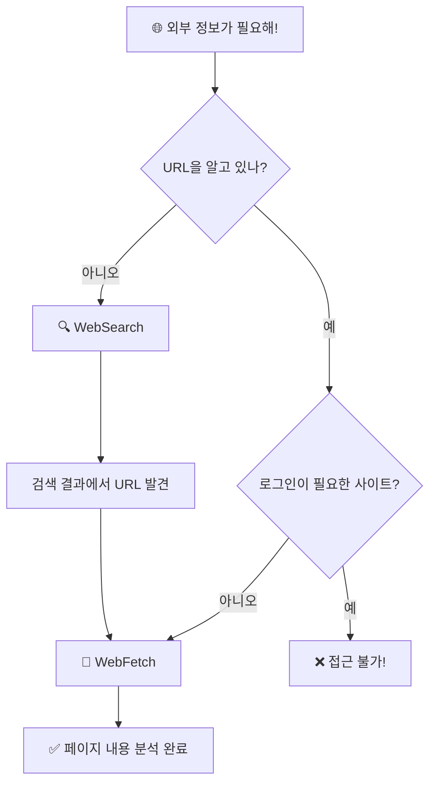

# 웹 검색/페치 ⭐⭐

> 클로드가 인터넷을 검색할 수 있다고? 실시간 정보도?

## 웹 검색이 왜 필요할까?

클로드 코드는 똑똒하지만, **학습 데이터에는 마감일**이 있습니다.
2025년 5월 이후의 정보는 모릅니다. 하지만 현실에서는:

- "React 최신 버전이 뭐야?"
- "이 라이브러리 아직 유지보수 중이야?"
- "오늘 날씨 어때?"

이런 **최신 정보**가 필요할 때, 클로드 코드가 직접 인터넷을 검색할 수 있습니다!

---

## 핵심 비유

클로드 코드에는 인터넷 정보를 가져오는 도구가 **2가지** 있습니다:

```
인터넷 정보 가져오기
│
├── 🔍 WebSearch   ← "비서에게 '이 주제 검색해와' 시키기"
│   검색엔진에서 결과를 가져옵니다
│
└── 📄 WebFetch    ← "비서에게 '이 페이지 가서 내용 정리해와' 시키기"
│   특정 URL의 내용을 가져와 분석합니다
```

쉽게 말하면:
- **WebSearch** = 도서관 사서에게 "이 주제 관련 책 찾아주세요" 🏛️
- **WebFetch** = 도서관 사서에게 "이 책 3장 요약해주세요" 📖

---

## 한눈에 비교

| 구분 | 🔍 WebSearch | 📄 WebFetch |
|------|-------------|-------------|
| **비유** | 검색 비서 (도서관에서 책 찾기) | 페이지 방문 비서 (특정 책 읽기) |
| **입력** | 검색어 (`query`) | URL + 질문 (`url` + `prompt`) |
| **결과** | 검색 결과 목록 (제목, 링크, 요약) | 페이지 내용 분석 결과 |
| **용도** | 최신 정보 탐색, 트렌드 파악 | 특정 페이지 상세 분석 |
| **비용** | 빠름 (검색 결과만) | 느림 (전체 페이지 읽기) |

---

## 언제 뭘 쓸까? (판단 흐름도)



---

## 파라미터 정리

### 🔍 WebSearch

| 파라미터 | 필수 | 설명 | 예시 |
|----------|------|------|------|
| `query` | ✅ | 검색어 | `"React 19 new features 2026"` |
| `allowed_domains` | ❌ | 이 사이트만 검색 | `["developer.mozilla.org"]` |
| `blocked_domains` | ❌ | 이 사이트 제외 | `["reddit.com"]` |

### 📄 WebFetch

| 파라미터 | 필수 | 설명 | 예시 |
|----------|------|------|------|
| `url` | ✅ | 가져올 웹 주소 | `"https://docs.anthropic.com/..."` |
| `prompt` | ✅ | 어떤 정보를 원하는지 | `"주요 기능 3가지를 요약해줘"` |

---

## ⚠️ 주의사항 (꼭 알아두세요!)

### 1. 로그인 필요 사이트는 접근 불가

WebFetch는 **공개 페이지**만 가져올 수 있습니다.

| ✅ 접근 가능 | ❌ 접근 불가 |
|-------------|-------------|
| 공식 문서 사이트 | Google Docs |
| 공개 블로그 | Notion |
| GitHub 공개 저장소 | Jira |
| 위키피디아 | 로그인 필요한 관리자 페이지 |
| 뉴스 사이트 (대부분) | 유료 구독 콘텐츠 |

> 💡 로그인이 필요한 서비스는 MCP 서버를 통해 연결해야 합니다 (07번 프로젝트에서 배웁니다)

### 2. prompt를 잘 써야 좋은 결과!

WebFetch에서 `prompt`는 **비서에게 내리는 지시**입니다.

```
❌ 나쁜 예: prompt = "내용"
   → 너무 모호해서 비서가 뭘 정리할지 모름

✅ 좋은 예: prompt = "이 페이지에서 설치 방법과 시스템 요구사항을 정리해줘"
   → 구체적이라서 비서가 정확히 찾아줌
```

### 3. 15분 캐시

같은 URL을 반복 요청하면 15분간 캐시된 결과를 줍니다.
→ 빠르긴 하지만, 페이지가 업데이트되어도 15분은 이전 내용이 나옵니다.

### 4. HTTP → HTTPS 자동 업그레이드

`http://`로 요청해도 자동으로 `https://`로 변환됩니다. 보안을 위해!

### 5. 리다이렉트 처리

WebFetch가 다른 호스트로 리다이렉트되면, 리다이렉트 URL을 알려줍니다.
그 URL로 다시 요청하면 됩니다.

---

## 예제 프로젝트

이 폴더에는 단계별로 따라할 수 있는 예제가 있습니다:

| # | 예제 | 난이도 | 설명 |
|---|------|--------|------|
| 1 | [WebSearch 기초](examples/search-basics/) | ⭐ | 검색, 도메인 필터, 최신 정보 찾기 |
| 2 | [WebFetch 분석](examples/fetch-analyze/) | ⭐⭐ | URL 분석, prompt 작성법, 실패 경험 |
| 3 | [리서치 프로젝트](examples/research-project/) | ⭐⭐ | WebSearch + WebFetch 조합 리서치 |

---

## 핵심 정리

```
┌─────────────────────────────────────────────┐
│  🔍 WebSearch                               │
│  • 검색어로 최신 정보 탐색                    │
│  • 도메인 필터로 범위 조절 가능               │
│  • 검색 결과 = 제목 + 링크 + 요약            │
├─────────────────────────────────────────────┤
│  📄 WebFetch                                │
│  • 특정 URL의 내용을 가져와 분석              │
│  • prompt가 구체적일수록 좋은 결과            │
│  • 로그인 사이트는 접근 불가!                 │
├─────────────────────────────────────────────┤
│  🔍 + 📄 조합                               │
│  • WebSearch로 URL 찾고                      │
│  • WebFetch로 상세 분석하면                   │
│  • 완벽한 리서치 완성! ✅                     │
└─────────────────────────────────────────────┘
```

---

## 더 알아보기

- [클로드 코드 공식 문서](https://docs.anthropic.com/en/docs/claude-code)
- WebSearch는 현재 미국 리전에서만 사용 가능합니다
- WebFetch와 비슷한 기능의 MCP 도구가 있으면 MCP 도구 사용을 권장합니다
