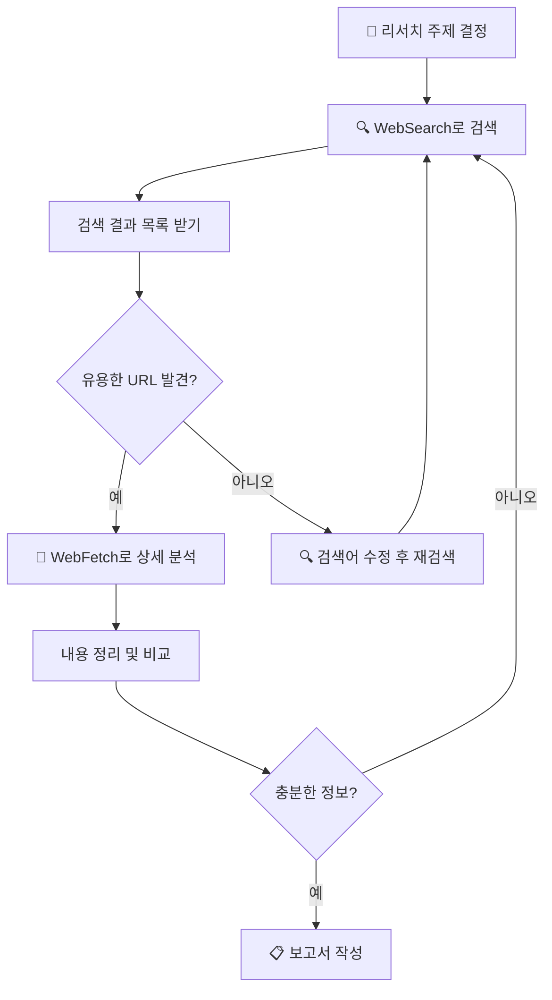

# 리서치 프로젝트: WebSearch + WebFetch 조합 ⭐⭐

> 검색으로 찾고, 페치로 분석하고, 보고서로 정리하기!

## 왜 조합이 강력할까?

WebSearch와 WebFetch를 **따로** 쓰면:
- WebSearch만 → 검색 결과 목록은 있지만, 상세 내용은 모름
- WebFetch만 → URL을 이미 알아야 하는데, 모르면?

**둘을 합치면** 진짜 리서치가 됩니다:

```
🔍 WebSearch  →  URL 발견!  →  📄 WebFetch  →  상세 분석!  →  📋 보고서
 (검색해서)      (찾았다!)      (읽어보니)      (정리하면)     (완성!)
```

비유하면:
1. 도서관 검색 시스템에서 책 제목 찾기 (WebSearch)
2. 그 책을 꺼내서 직접 읽기 (WebFetch)
3. 읽은 내용을 독후감으로 정리하기 (보고서)

---

## 리서치 흐름



---

## 실전 예시: 클로드 코드 최신 기능 조사

### Phase 1: 검색으로 URL 수집 🔍

```
사용자: 클로드 코드의 2026년 최신 기능에 대해 검색해줘
```

클로드가 WebSearch 호출:
```
WebSearch:
  query: "Claude Code new features 2026"
```

검색 결과 (예시):
```
1. "Claude Code Changelog" - github.com/anthropics/claude-code
2. "Claude Code Documentation" - docs.anthropic.com
3. "Claude Code 2026 Updates" - blog.anthropic.com
```

### Phase 2: 주요 페이지 분석 📄

검색에서 찾은 URL들을 하나씩 분석합니다:

```
사용자: 위 검색 결과 중 공식 문서와 체인지로그를 분석해줘
```

클로드가 WebFetch를 여러 번 호출:

```
WebFetch #1:
  url: "https://docs.anthropic.com/en/docs/claude-code"
  prompt: "2026년에 추가된 새 기능을 찾아서 목록으로 정리해줘"

WebFetch #2:
  url: "https://github.com/anthropics/claude-code/blob/main/CHANGELOG.md"
  prompt: "최근 3개월간의 주요 변경사항을 요약해줘"
```

### Phase 3: 보고서 작성 📋

```
사용자: 검색하고 분석한 내용을 보고서로 정리해줘
```

→ 클로드가 수집한 정보를 종합해서 보고서를 작성합니다!

---

## 따라하기: 직접 리서치 해보기

### 미션: "2026년 프론트엔드 트렌드 조사"

#### Step 1: 주제 검색

```
사용자: 2026년 프론트엔드 개발 트렌드를 검색해줘
```

#### Step 2: 주요 출처 분석

```
사용자: 검색 결과 중 가장 신뢰할 수 있는 출처 2-3개를 골라서
       상세 내용을 분석해줘
```

#### Step 3: 보고서 작성

```
사용자: 조사한 내용을 바탕으로 보고서를 작성해줘.
       다음 형식으로:
       - 조사 개요 (날짜, 사용 도구)
       - 주요 트렌드 3-5가지
       - 각 트렌드별 설명과 출처
       - 결론
```

#### Step 4: 파일로 저장

```
사용자: 이 보고서를 research-report.md 파일로 저장해줘
```

---

## 리서치 팁

### 1. 검색어를 단계적으로 구체화하기

```
1차 검색: "frontend trends 2026"              ← 넓은 범위
2차 검색: "React Server Components 2026"       ← 발견한 키워드로 좁히기
3차 검색: "React Server Components performance" ← 더 구체적으로
```

### 2. 여러 출처 교차 확인

한 곳의 정보만 믿지 말고, 최소 2-3개 출처를 비교하세요:

```
출처 1: 공식 문서 → 정확하지만 마케팅적
출처 2: 개발자 블로그 → 실사용 경험
출처 3: GitHub 이슈 → 실제 문제점
```

### 3. 도메인 필터 활용

```
신뢰 높은 출처만:
  allowed_domains: ["docs.anthropic.com", "github.com"]

커뮤니티 의견 수집:
  allowed_domains: ["reddit.com", "news.ycombinator.com"]
```

---

## 예상 결과물

이 리서치를 완료하면 `expected-output/research-report.md`와 비슷한 보고서가 만들어집니다.

→ [예상 보고서 보기](expected-output/research-report.md)

---

## 핵심 정리

```
┌─────────────────────────────────────────────┐
│  🔍 + 📄 리서치 조합 핵심                    │
│                                             │
│  1. WebSearch로 관련 URL을 먼저 수집          │
│  2. WebFetch로 중요한 페이지를 상세 분석       │
│  3. 여러 출처를 비교해서 신뢰도 높이기         │
│  4. 검색어를 단계적으로 구체화                 │
│  5. 최종 결과를 보고서로 정리                  │
└─────────────────────────────────────────────┘
```

---

## 더 연습해보기: 리서치 주제 아이디어

| 주제 | 검색 시작점 | 난이도 |
|------|-----------|--------|
| "내가 쓰는 라이브러리 최신 버전 확인" | 라이브러리 이름 + release | ⭐ |
| "두 프레임워크 비교" | "A vs B 2026" | ⭐⭐ |
| "특정 기술의 장단점 조사" | 기술명 + pros cons | ⭐⭐ |
| "업계 트렌드 종합 보고서" | 분야 + trends 2026 | ⭐⭐⭐ |
