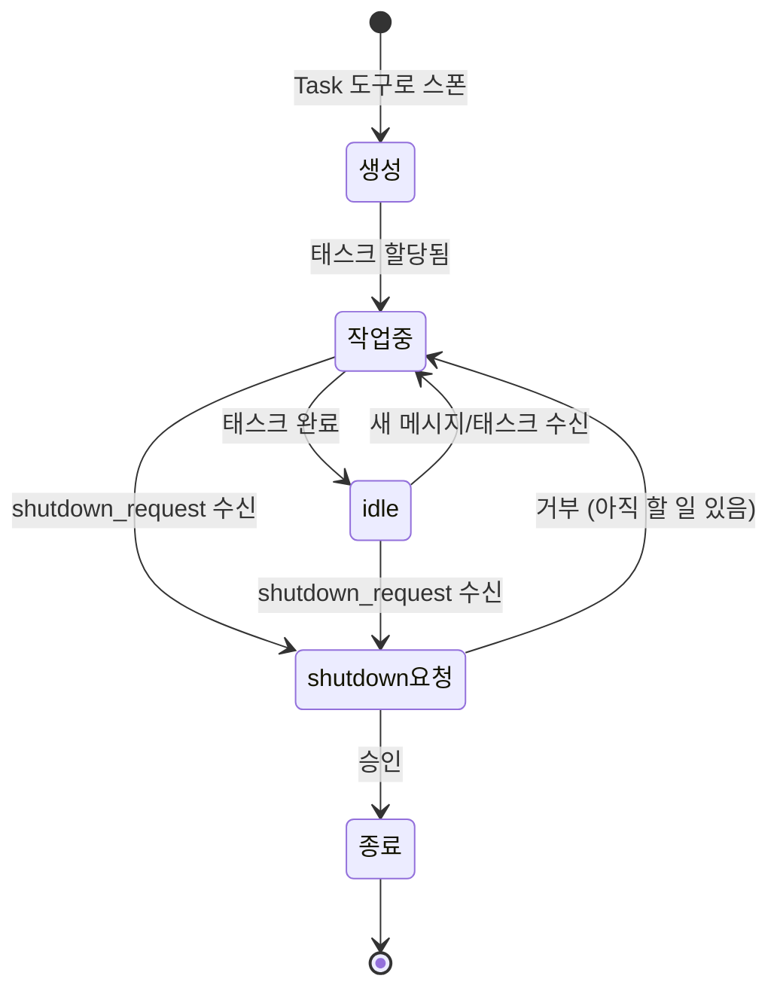
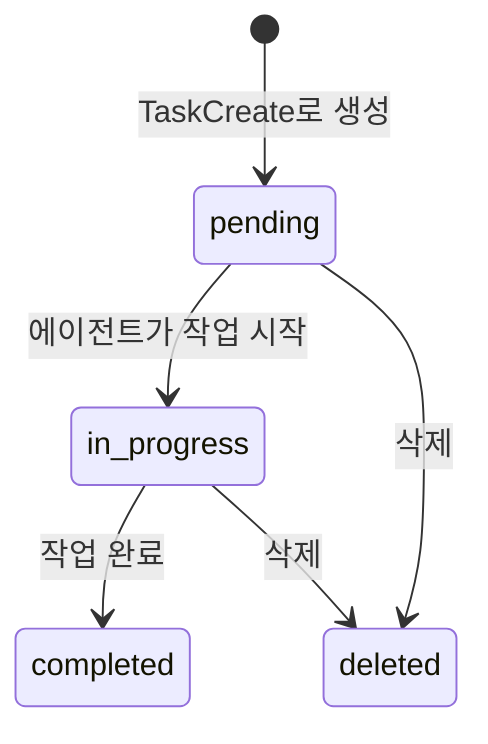

# Agent Teams 내부 구조 ⭐⭐⭐

> Agent Teams가 내부적으로 어떻게 동작하는지 살펴봅시다.

---

## 파일 시스템 구조

Agent Teams의 데이터는 `~/.claude/` 아래에 저장됩니다.

```
~/.claude/
├── teams/
│   └── {team-name}/
│       └── config.json      # 팀 설정 + 멤버 목록
└── tasks/
    └── {team-name}/
        └── (task files)     # 태스크 데이터
```

### config.json 예시

팀을 만들면 자동으로 생성되는 설정 파일입니다.

```json
{
  "name": "todo-webapp-team",
  "description": "Todo 웹앱을 만드는 팀",
  "created_at": "2025-01-15T09:00:00Z",
  "members": [
    {
      "name": "team-lead",
      "role": "leader",
      "status": "active"
    },
    {
      "name": "frontend",
      "role": "teammate",
      "agent_type": "general-purpose",
      "status": "active"
    },
    {
      "name": "backend",
      "role": "teammate",
      "agent_type": "general-purpose",
      "status": "active"
    },
    {
      "name": "researcher",
      "role": "teammate",
      "agent_type": "Explore",
      "status": "idle"
    }
  ]
}
```

**주요 필드 설명:**

| 필드 | 설명 |
|------|------|
| `name` | 팀 이름 (고유값) |
| `description` | 팀 설명 |
| `members` | 팀원 목록 |
| `members[].name` | 팀원 이름 (메시지 보낼 때 사용) |
| `members[].role` | `leader` 또는 `teammate` |
| `members[].agent_type` | 에이전트 종류 |
| `members[].status` | `active`, `idle`, `shutdown` |

---

## 에이전트 생명주기

에이전트는 생성부터 종료까지 아래와 같은 과정을 거칩니다.



### 각 상태 설명

| 상태 | 의미 | 비유 |
|------|------|------|
| **생성** | 에이전트가 만들어진 직후 | 모둠원이 자리에 앉음 |
| **작업중** | 태스크를 수행하고 있는 상태 | 열심히 일하는 중 |
| **idle** | 할 일을 다 끝내고 대기 중 | 손 들고 "다 했어요!" |
| **shutdown 요청** | 리더가 "종료해도 돼?" 물어봄 | "이제 쉬어도 돼?" |
| **종료** | 에이전트가 완전히 멈춤 | 퇴근! |

> **참고**: idle 상태는 에러가 아닙니다! 할 일을 마치고 다음 지시를 기다리는 정상 상태예요.

---

## 태스크 상태 흐름

태스크(할 일)는 3가지 상태를 거칩니다.



### 상태 설명

| 상태 | 의미 | 전환 조건 |
|------|------|----------|
| **pending** | 아직 시작 안 함 | 생성 직후 기본값 |
| **in_progress** | 누군가 작업 중 | `TaskUpdate`로 status 변경 |
| **completed** | 완료! | `TaskUpdate`로 status 변경 |
| **deleted** | 삭제됨 | `TaskUpdate`로 status 변경 |

### 의존성 (blockedBy)

태스크 간에 **순서**를 지정할 수 있습니다.

```
태스크 #1: API 설계       (pending)
태스크 #2: 백엔드 구현     (blockedBy: [1]) ← #1이 끝나야 시작 가능
태스크 #3: 프론트엔드 구현  (blockedBy: [1]) ← #1이 끝나야 시작 가능
태스크 #4: 통합 테스트     (blockedBy: [2, 3]) ← #2, #3 모두 끝나야
```

```
#1 API 설계
 ├──▶ #2 백엔드 구현 ──┐
 └──▶ #3 프론트엔드 구현 ┤
                        └──▶ #4 통합 테스트
```

---

## 메시지 전달 흐름

에이전트 간의 메시지가 어떻게 전달되는지 살펴봅시다.

### DM (1:1 메시지)

```
frontend 에이전트                          backend 에이전트
     │                                         │
     │  SendMessage({                          │
     │    type: "message",                     │
     │    recipient: "backend",                │
     │    content: "API 엔드포인트 알려줘",      │
     │    summary: "API 정보 요청"              │
     │  })                                     │
     │ ──────────────────────────────────────▶  │
     │                                         │  (메시지 수신)
     │                                         │  (idle → 작업중)
     │                                         │
     │  ◀──────────────────────────────────── │
     │    "POST /todos, GET /todos 입니다"      │
```

### Broadcast (전체 메시지)

```
team-lead
     │  SendMessage({
     │    type: "broadcast",
     │    content: "DB 스키마 변경됨, 확인 부탁",
     │    summary: "DB 스키마 변경 공지"
     │  })
     │
     ├──▶ frontend  (수신)
     ├──▶ backend   (수신)
     └──▶ tester    (수신)
```

> **주의**: broadcast는 모든 팀원에게 전달되므로 비용이 높습니다. 꼭 필요한 경우에만 사용하세요!

### Shutdown 흐름

```
team-lead                              backend 에이전트
     │                                      │
     │  SendMessage({                       │
     │    type: "shutdown_request",          │
     │    recipient: "backend",             │
     │    content: "작업 끝났으니 종료해줘"    │
     │  })                                  │
     │ ──────────────────────────────────▶   │
     │                                      │ (요청 확인)
     │                                      │
     │  ◀────────────────────────────────── │
     │  SendMessage({                       │
     │    type: "shutdown_response",         │
     │    approve: true                     │  → 종료됨!
     │  })                                  │
```

---

## 전체 아키텍처 요약

```
┌──────────────────────────────────────────────────┐
│                 Agent Teams                       │
│                                                  │
│  ┌────────────┐    메시지     ┌────────────┐     │
│  │ team-lead  │◄────────────▶│ frontend   │     │
│  │ (리더)     │              └────────────┘     │
│  │            │    메시지     ┌────────────┐     │
│  │            │◄────────────▶│ backend    │     │
│  │            │              └────────────┘     │
│  │            │    메시지     ┌────────────┐     │
│  │            │◄────────────▶│ tester     │     │
│  └────────────┘              └────────────┘     │
│        │                          │              │
│        │    ┌──────────────────┐  │              │
│        └───▶│  태스크 보드     │◀─┘              │
│             │  (공유 상태)     │                  │
│             └──────────────────┘                  │
│                      │                           │
│              ┌───────┴────────┐                   │
│              ▼                ▼                   │
│     ~/.claude/teams/   ~/.claude/tasks/           │
│     (팀 설정)          (태스크 데이터)             │
└──────────────────────────────────────────────────┘
```

---

## 다음으로 읽기

- [Agent Teams 개념 이해](overview.md) — 기본 개념부터 알고 싶다면
- [Task(서브에이전트) vs Agent Teams 비교](vs-subagent.md) — 무엇을 선택할지 고민된다면
- [도구 API 레퍼런스](../reference/tool-api.md) — 각 도구의 상세 사용법
