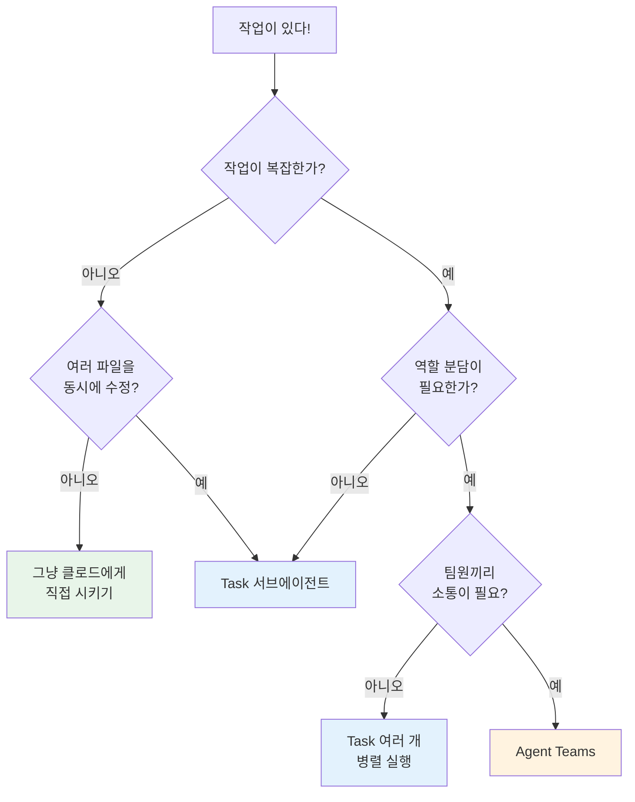

# Task(서브에이전트) vs Agent Teams 비교 ⭐⭐

> "혼자 심부름 보내기" vs "모둠 활동하기" — 어떤 차이가 있을까요?

---

## 비유로 이해하기

### Task (서브에이전트) = 심부름

```
나 ──"도서관에서 책 찾아와"──▶ 심부름꾼
                                  │
나 ◀──"여기 있어요"─────────────┘
```

- 한 명에게 **하나의 일**을 시키고 결과만 받습니다
- 심부름꾼끼리는 서로 모릅니다
- 일이 끝나면 바로 돌아옵니다

### Agent Teams = 모둠 활동

```
모둠장 ──▶ 모둠원A (자료 조사)
   │   ──▶ 모둠원B (발표 자료)
   │   ──▶ 모둠원C (대본 작성)
   │
   │  모둠원A ──"이 자료 참고해"──▶ 모둠원B
   │  모둠원B ──"디자인 어때?"──▶ 모둠원C
   │
   └── 할일판으로 진행 상황 공유
```

- 여러 명이 **동시에** 다양한 일을 합니다
- 팀원끼리 **서로 소통**할 수 있습니다
- 작업이 끝나도 **다음 할 일**을 기다립니다

---

## 비교표

| 항목 | Task (서브에이전트) | Agent Teams |
|------|-------------------|-------------|
| **구조** | 1:1 (부모 → 자식) | N:N (팀) |
| **통신** | 결과만 반환 | DM, broadcast, 태스크 보드 |
| **상태 공유** | 없음 | 태스크 보드로 실시간 공유 |
| **비용** | 낮음 (필요할 때만 실행) | 높음 (에이전트 수만큼 비용 발생) |
| **적합한 작업** | 단순 검색, 파일 분석 | 복잡한 프로젝트, 역할 분담 |
| **수명** | 작업 완료 시 자동 종료 | 명시적 shutdown까지 유지 |
| **팀원 간 소통** | 불가능 | 가능 (SendMessage) |
| **작업 관리** | 없음 | 태스크 보드 (생성/조회/갱신) |

---

## 선택 가이드

어떤 걸 써야 할지 고민된다면, 아래 흐름을 따라가 보세요.



---

## 구체적 예시

### Task가 적합한 경우

```
"이 코드베이스에서 TODO 주석을 모두 찾아줘"
→ Task(Explore)로 검색 한 번이면 끝!

"이 함수가 뭐 하는지 분석해줘"
→ Task로 분석 결과만 받으면 됨

"package.json 의존성을 정리해줘"
→ 단일 파일 작업, Task로 충분
```

### Agent Teams가 적합한 경우

```
"Todo 웹앱을 만들어줘 (프론트 + 백엔드 + 테스트)"
→ 프론트 에이전트, 백엔드 에이전트, 테스트 에이전트가 동시 작업

"이 프로젝트를 TypeScript로 마이그레이션해줘"
→ 조사 에이전트가 변환 계획 수립, 구현 에이전트들이 파일별 변환

"API 문서를 보고 클라이언트 SDK를 만들어줘"
→ 리서치 에이전트가 API 분석, 코딩 에이전트가 SDK 작성
```

---

## 비용 비교

```
Task (서브에이전트):
├── 필요할 때 생성
├── 작업 끝나면 즉시 종료
└── 💰 작업당 비용만 발생

Agent Teams:
├── 팀 생성 시 에이전트들 시작
├── shutdown 전까지 계속 유지
├── idle 상태에서도 유지 비용 존재
└── 💰💰💰 에이전트 수 x 실행 시간
```

> **팁**: Agent Teams를 쓸 때는 작업이 끝나면 빠르게 shutdown하여 비용을 절약하세요!

---

## 다음으로 읽기

- [Agent Teams 개념 이해](overview.md) — 기본 개념부터 알고 싶다면
- [Agent Teams 내부 구조](architecture.md) — 기술적인 구조가 궁금하다면
