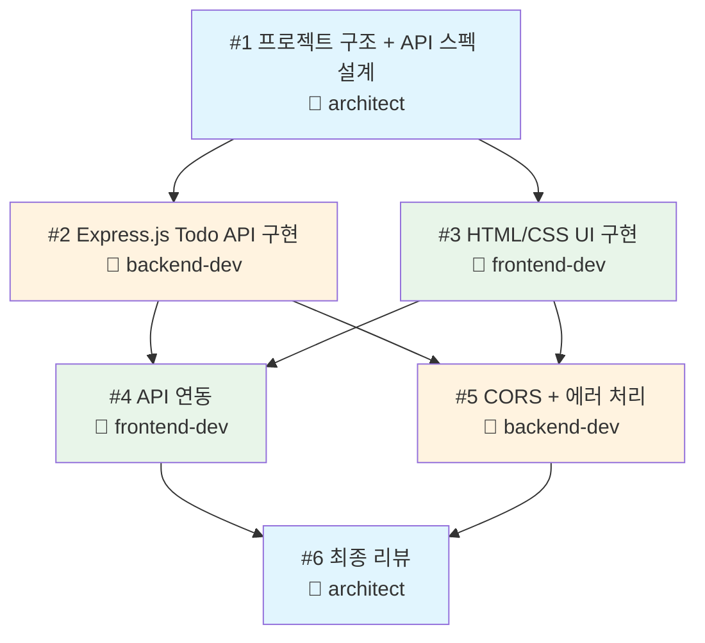

# Todo 웹앱 팀 개발 시나리오 ⭐⭐⭐

> 4명의 AI 에이전트가 협력하여 Todo 웹앱을 만드는 실전 시나리오

---

## 시나리오 개요

이 시나리오에서는 Agent Teams의 핵심 기능을 모두 활용하여, **팀을 구성하고 → 태스크를 나누고 → 에이전트들이 협력하여** 하나의 Todo 웹앱을 완성합니다.

**만들어지는 것:**
- Express.js 기반 REST API 백엔드
- HTML/CSS/JS 프론트엔드
- 프론트엔드 ↔ 백엔드 API 연동

---

## 팀 구성

| 역할 | 에이전트 이름 | subagent_type | 담당 |
|------|-------------|---------------|------|
| 팀 리더 | leader (사용자) | - | 전체 조율, 태스크 생성/배정 |
| 설계자 | architect | general-purpose | API 스펙, 프로젝트 구조 설계 |
| 백엔드 | backend-dev | general-purpose | Express.js API 서버 구현 |
| 프론트엔드 | frontend-dev | general-purpose | HTML/CSS/JS UI 구현 |

> **leader는 사용자 자신**입니다. Claude Code에서 직접 지시를 내리는 역할이에요.

---

## 태스크 의존성 그래프



**색상 범례:**
- 파란색: architect 담당
- 주황색: backend-dev 담당
- 초록색: frontend-dev 담당

---

## 에이전트 간 상호작용 포인트

시나리오 진행 중 에이전트들이 소통하는 주요 지점들:

### 1. T1 완료 후 — 설계 공유
```
architect → backend-dev: API 엔드포인트 스펙 전달
architect → frontend-dev: UI 구조와 데이터 모델 전달
```

### 2. T2, T3 진행 중 — 구현 세부사항 조율
```
backend-dev → frontend-dev: 서버 포트, 응답 형식 공유
frontend-dev → backend-dev: 필요한 API 필드 요청
```

### 3. T4 진행 시 — API 연동
```
frontend-dev → backend-dev: CORS 문제 발견 시 알림
backend-dev → frontend-dev: CORS 설정 완료 알림
```

### 4. T6 리뷰 — 최종 확인
```
architect → backend-dev: 코드 리뷰 피드백
architect → frontend-dev: 코드 리뷰 피드백
architect → leader: 최종 리뷰 결과 보고
```

---

## 예상 결과물

작업이 완료되면 다음 파일들이 생성됩니다:

| 파일 | 담당 | 설명 |
|------|------|------|
| `server.js` | backend-dev | Express.js API 서버 (CRUD) |
| `index.html` | frontend-dev | HTML 구조 |
| `style.css` | frontend-dev | CSS 스타일링 |
| `app.js` | frontend-dev | 프론트엔드 JS (API 호출) |

> 예상 결과물 미리보기: [expected-output/](expected-output/)

---

## 실행 방법

상세한 프롬프트 가이드를 따라하세요:

> [Todo 웹앱 프롬프트 가이드](prompt-guide.md)

---

## 주의사항

| 항목 | 설명 |
|------|------|
| 토큰 사용량 | 에이전트 3명 + 리더가 동시에 작업하므로 토큰 소모가 **많습니다** |
| 실행 환경 | Node.js가 설치되어 있어야 합니다 (`node -v`로 확인) |
| 비용 | 실험적 기능이므로 학습 목적으로만 사용을 권장합니다 |
| 결과 차이 | AI 특성상 매번 약간 다른 결과가 나올 수 있습니다 |
