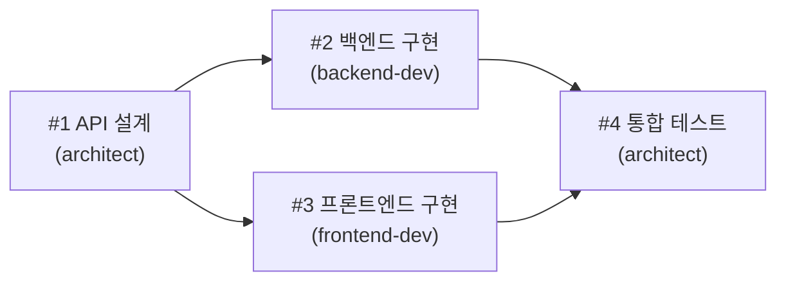

# Step 3 — 태스크 보드 사용하기 ⭐⭐

> 태스크를 만들고, 배정하고, 의존성을 설정해보자!

---

## 태스크란?

태스크(Task)는 **할 일 목록**입니다. Agent Teams에서는 태스크를 통해 에이전트들에게 일을 나눠주고, 진행 상황을 추적합니다.

```
태스크 = 누가(owner) + 무엇을(subject) + 상태(status)
```

---

## 태스크 생성 — TaskCreate

```
"API 설계" 태스크를 만들어줘
```

Claude가 내부적으로 실행하는 것:

```
TaskCreate
├── subject: "API 설계"
├── description: "REST API 엔드포인트를 설계한다"
└── activeForm: "API를 설계하는 중"
```

생성된 태스크는 자동으로 `pending` 상태가 됩니다.

---

## 태스크 조회 — TaskList

```
현재 태스크 목록을 보여줘
```

**결과 예시:**

| ID | Subject | Status | Owner | Blocked By |
|----|---------|--------|-------|------------|
| #1 | API 설계 | pending | - | - |
| #2 | 백엔드 구현 | pending | - | #1 |
| #3 | 프론트엔드 구현 | pending | - | #1 |

---

## 태스크 상태 변경 — TaskUpdate

태스크의 상태는 3단계로 진행됩니다:

```
pending ──→ in_progress ──→ completed
(대기 중)     (진행 중)       (완료)
```

**상태 변경 예시:**

```
TaskUpdate
├── taskId: "1"
└── status: "in_progress"
```

---

## 담당자 배정 — owner

태스크를 특정 에이전트에게 배정합니다:

```
1번 태스크를 architect에게 배정해줘
```

```
TaskUpdate
├── taskId: "1"
└── owner: "architect"
```

에이전트는 자신에게 배정된 태스크를 확인하고 작업을 시작합니다.

---

## 의존성 설정 — blockedBy

"B 태스크는 A 태스크가 끝나야 시작할 수 있다"를 표현합니다:

```
TaskUpdate
├── taskId: "2"
└── addBlockedBy: ["1"]   ← 1번이 끝나야 2번 시작 가능
```

**여러 태스크에 의존할 수도 있습니다:**

```
TaskUpdate
├── taskId: "4"
└── addBlockedBy: ["2", "3"]   ← 2번과 3번 모두 끝나야 시작
```

---

## 의존성 시각화

태스크 간의 관계를 그림으로 보면 이해가 쉽습니다:



**읽는 방법:**
- 화살표는 "이것이 끝나야 다음 것을 시작"을 의미합니다
- T1이 끝나면 T2와 T3을 **동시에** 시작할 수 있습니다
- T4는 T2와 T3이 **모두** 끝나야 시작합니다

---

## 태스크 도구 정리

| 도구 | 역할 | 주요 파라미터 |
|------|------|--------------|
| **TaskCreate** | 태스크 생성 | subject, description, activeForm |
| **TaskList** | 목록 조회 | (없음) |
| **TaskGet** | 상세 조회 | taskId |
| **TaskUpdate** | 상태/담당 변경 | taskId, status, owner, addBlockedBy |

---

## 다음 단계

태스크 관리를 배웠으니, 에이전트끼리 어떻게 대화하는지 알아봅시다!

> [Step 4 — 메시지 시스템](step-04-messaging.md)
