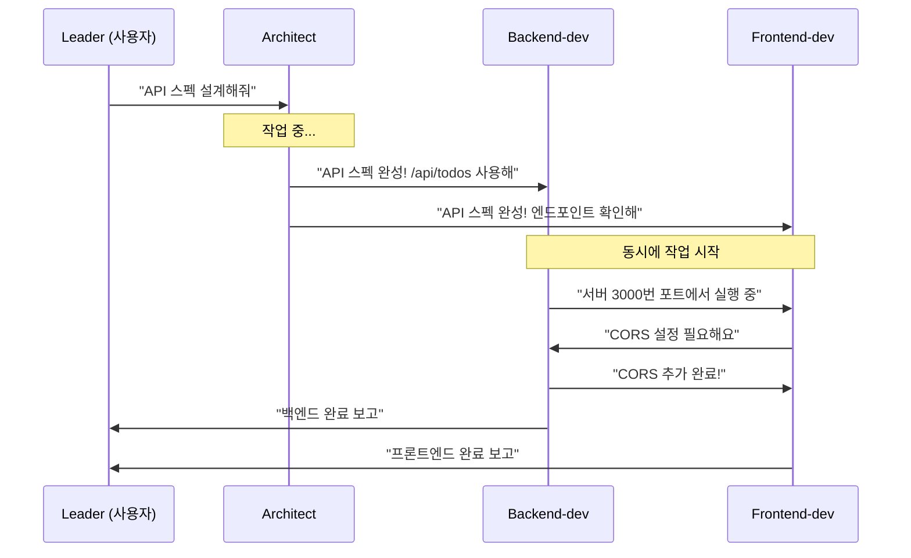

# Step 4 — 메시지 시스템 ⭐⭐

> 에이전트끼리 어떻게 대화하는지 알아보자!

---

## 왜 메시지가 필요한가요?

에이전트들은 각각 **독립적으로 실행**됩니다. 서로의 작업 내용을 직접 볼 수 없기 때문에, **메시지를 주고받아야** 협업할 수 있습니다.

```
에이전트 A ──메시지──→ 에이전트 B
            (SendMessage 도구)
```

---

## 메시지 유형

### 1. 1:1 메시지 (DM) — `type: "message"`

특정 에이전트 **한 명**에게 보내는 메시지입니다.

```
SendMessage
├── type: "message"
├── recipient: "backend-dev"       ← 받는 사람 (필수!)
├── content: "API 스펙이 완성됐어. server.js를 확인해줘."
└── summary: "API 스펙 완성 알림"  ← UI에 표시되는 요약
```

> **가장 많이 쓰는 유형**입니다. 기본적으로 이것을 사용하세요.

---

### 2. 전체 공지 (Broadcast) — `type: "broadcast"`

**모든 팀원**에게 동시에 보내는 메시지입니다.

```
SendMessage
├── type: "broadcast"
├── content: "긴급! 포트 3000이 충돌합니다. 모두 3001로 변경해주세요."
└── summary: "포트 변경 긴급 공지"
```

> **주의: 비용이 높습니다!** 팀원 수만큼 메시지가 각각 전달되기 때문입니다.
> 팀원이 5명이면 5개의 메시지가 발생합니다.

**broadcast를 쓸 때:**
- 모든 팀원에게 영향을 주는 긴급한 변경사항
- 전체 작업 중단/재시작 공지

**broadcast 대신 message를 쓸 때:**
- 특정 에이전트에게만 관련 있는 내용
- 일반적인 업무 소통
- 진행 상황 보고

---

### 3. 종료 요청 — `type: "shutdown_request"`

에이전트에게 "이제 종료해도 돼"라고 요청합니다.

```
SendMessage
├── type: "shutdown_request"
├── recipient: "backend-dev"
└── content: "작업 완료! 종료해줘."
```

---

### 4. 종료 응답 — `type: "shutdown_response"`

종료 요청을 받은 에이전트가 수락 또는 거절합니다.

**수락하는 경우:**
```
SendMessage
├── type: "shutdown_response"
├── request_id: "abc-123"     ← 요청에 포함된 ID
└── approve: true
```

**거절하는 경우:**
```
SendMessage
├── type: "shutdown_response"
├── request_id: "abc-123"
├── approve: false
└── content: "아직 3번 태스크 작업 중입니다. 5분만 더 주세요."
```

---

## idle 상태란?

에이전트가 할 일이 없으면 **idle(대기) 상태**에 들어갑니다.

```
작업 중 ──→ 작업 완료 ──→ idle (대기)
                            │
                    메시지 도착!
                            │
                            ▼
                      다시 활성화 ──→ 작업 시작
```

**idle은 정상입니다!** 에이전트가 멈춘 게 아닙니다.
- 메시지가 오면 자동으로 깨어납니다
- 새 태스크가 배정되면 자동으로 시작합니다
- 수동으로 확인할 필요가 없습니다 — 메시지는 **자동 전달**됩니다

---

## 메시지 흐름 예시

실제 프로젝트에서 메시지가 어떻게 오가는지 봅시다:



---

## 메시지 유형 비교

| 유형 | 대상 | 비용 | 사용 시점 |
|------|------|------|-----------|
| `message` | 1명 | 낮음 | 일반 소통 (기본값) |
| `broadcast` | 전원 | 높음 | 긴급 공지만 |
| `shutdown_request` | 1명 | 낮음 | 작업 종료 시 |
| `shutdown_response` | 요청자 | 낮음 | 종료 요청에 응답 |

---

## 핵심 기억하기

1. **기본은 message** — broadcast는 정말 필요할 때만
2. **idle은 정상** — 메시지가 오면 자동으로 깨어남
3. **자동 전달** — 메시지를 수동으로 확인할 필요 없음
4. **작업 끝나면 shutdown** — 불필요한 에이전트는 바로 종료

---

## 다음 단계

메시지 시스템을 이해했으니, 실전 프로젝트로 모든 것을 연습해봅시다!

> [Step 5 — 실전 프로젝트: Todo 웹앱](step-05-real-project.md)
