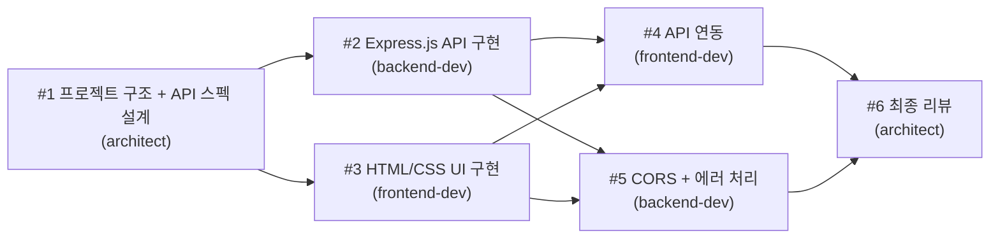

# Step 5 — 실전 프로젝트: Todo 웹앱 ⭐⭐⭐

> 4명의 AI 에이전트가 협력해서 Todo 웹앱을 만드는 과정을 체험해보자!

---

## 시나리오 소개

이 실전 프로젝트에서는 지금까지 배운 모든 것을 활용합니다:
- 팀 생성
- 태스크 관리와 의존성
- 에이전트 간 메시지 교환

> 상세한 시나리오 문서: [scenarios/todo-webapp/](../scenarios/todo-webapp/)

---

## 팀 구성

| 역할 | 에이전트 이름 | 담당 |
|------|-------------|------|
| 팀 리더 | leader (사용자) | 전체 조율, 태스크 배정 |
| 설계자 | architect | API 스펙, 프로젝트 구조 설계 |
| 백엔드 | backend-dev | Express.js API 서버 구현 |
| 프론트엔드 | frontend-dev | HTML/CSS/JS UI 구현 |

---

## 태스크 의존성 그래프



**흐름 설명:**
1. architect가 설계를 완성하면 (T1)
2. backend-dev와 frontend-dev가 **동시에** 각자 작업 시작 (T2, T3)
3. 둘 다 끝나면 API 연동(T4)과 CORS 처리(T5)를 진행
4. 마지막으로 architect가 전체를 리뷰 (T6)

---

## 프롬프트 가이드

실제로 Claude Code에 입력할 프롬프트를 단계별로 정리해두었습니다:

> [Todo 웹앱 프롬프트 가이드](../scenarios/todo-webapp/prompt-guide.md)

프롬프트 가이드를 따라가면, 팀 생성부터 종료까지 전 과정을 체험할 수 있습니다.

---

## 예상 결과물

작업이 완료되면 다음과 같은 파일들이 생성됩니다:

```
todo-webapp/expected-output/
├── server.js      ← Express.js API 서버
├── index.html     ← HTML 구조
├── style.css      ← CSS 스타일
└── app.js         ← 프론트엔드 JavaScript (API 연동)
```

> 예상 결과물을 미리 확인하세요: [expected-output/](../scenarios/todo-webapp/expected-output/)

---

## 실행 시 관찰 포인트

실전 프로젝트를 실행하면서 이런 점들을 관찰해보세요:

### 1. 에이전트 간 메시지

```
architect → backend-dev: "API 스펙은 /api/todos, GET/POST/PUT/DELETE입니다"
architect → frontend-dev: "UI는 index.html 한 파일로 만들어주세요"
```

에이전트들이 서로 필요한 정보를 자동으로 주고받습니다.

### 2. 태스크 자동 할당

```
T1 완료 → T2, T3 자동으로 unblock → 각 담당자에게 알림
```

의존성이 해제되면 다음 태스크가 자동으로 시작 가능해집니다.

### 3. idle → active 전환

```
frontend-dev: idle (T1 완료 대기 중)
  ↓
T1 완료 알림 도착!
  ↓
frontend-dev: active (T3 작업 시작)
```

대기 중이던 에이전트가 메시지를 받으면 자동으로 깨어나서 작업을 시작합니다.

---

## 주의사항

| 항목 | 설명 |
|------|------|
| 토큰 사용량 | 에이전트 4명이 동시에 작업하므로 토큰 소모가 많습니다 |
| 실행 시간 | 에이전트 간 통신에 시간이 걸릴 수 있습니다 |
| 비용 관리 | 완료 후 반드시 팀을 종료하고 삭제하세요 |

---

## 다음 단계

실전 프로젝트를 마쳤으면 (또는 관찰만 했으면), 깔끔하게 정리하는 방법을 배웁시다!

> [Step 6 — 종료와 정리](step-06-cleanup.md)
