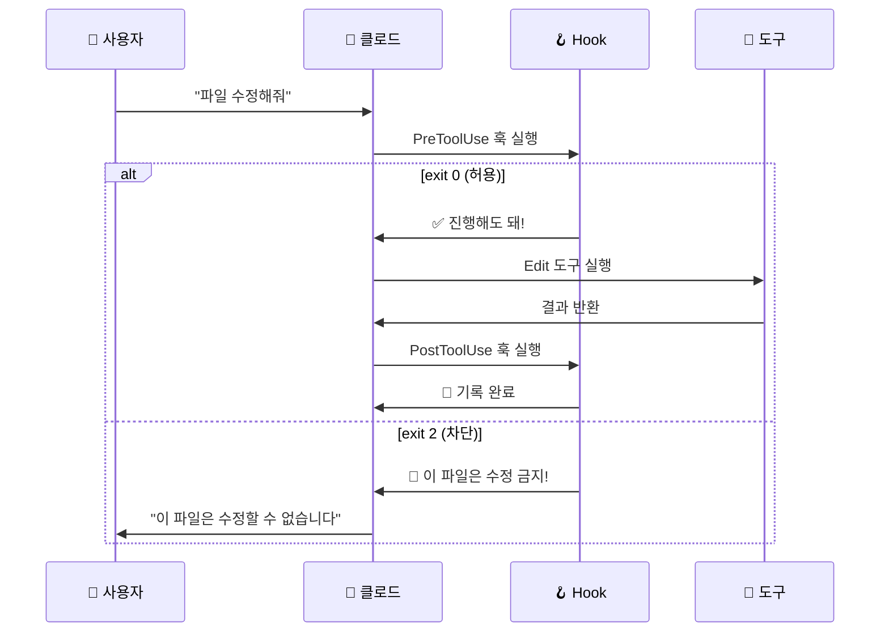

# Hooks — 클로드에 자동 센서 달기 ⭐⭐

> 클로드가 파일을 수정할 때 자동으로 백업하면 어떨까? 🪝

클로드 코드가 도구를 사용할 때마다 **자동으로 실행되는 스크립트**를 달 수 있다면 어떨까요?
파일을 수정하기 전에 "정말 괜찮아?" 확인하거나, 수정한 후에 자동으로 기록을 남기거나...
이런 걸 가능하게 해주는 게 바로 **Hooks**입니다!

---

## 핵심 비유: 교실 문 센서 🚪

교실 문에 센서가 달려 있다고 상상해보세요.

```
🚪 교실 문 (= 클로드의 도구 사용)
━━━━━━━━━━━━━━━━━━━━━━━━━━━━━━━

  문이 열릴 때 (PreToolUse)     문이 닫힐 때 (PostToolUse)
  ┌─────────────────────┐      ┌─────────────────────┐
  │ 💡 자동으로 불 켜짐   │      │ ❄️ 자동으로 에어컨 끔 │
  │ 📋 출입 기록 남김     │      │ 📝 퇴실 기록 남김     │
  │ 🚫 금지구역이면 차단!  │      │ ✅ 정리 완료 확인     │
  └─────────────────────┘      └─────────────────────┘
```

**Hooks = 클로드의 도구 사용에 달려있는 자동 센서!** 🔔

- 🚪 문이 열릴 때 → **PreToolUse**: 도구 사용 **전**에 실행
- 🚪 문이 닫힐 때 → **PostToolUse**: 도구 사용 **후**에 실행
- 🔔 알림 벨 → **Notification**: 알림이 발생할 때 실행
- 🏫 하교 벨 → **Stop**: 대화가 끝날 때 실행

---

## 4종 훅 비교표

| 훅 종류 | 언제 실행? | 차단 가능? | 비유 |
|---------|-----------|-----------|------|
| **PreToolUse** | 도구 사용 **전** | ✅ (`exit 2`) | 🚪 문 열기 전 센서 |
| **PostToolUse** | 도구 사용 **후** | ❌ | 🚪 문 닫은 후 센서 |
| **Notification** | 알림 발생 시 | ❌ | 🔔 알림 벨 |
| **Stop** | 대화 종료 시 | ❌ | 🏫 하교 벨 |

> 💡 **핵심 포인트:** 도구 사용을 **차단**할 수 있는 건 `PreToolUse`뿐이에요!

---

## 훅의 동작 흐름



---

## 환경변수 — 훅이 받는 정보

훅 스크립트가 실행될 때, 클로드가 자동으로 **환경변수**를 넘겨줍니다.

| 환경변수 | 설명 | 사용 가능한 훅 |
|---------|------|--------------|
| `CLAUDE_TOOL_NAME` | 사용된 도구 이름 (예: `Write`, `Edit`, `Bash`) | 모든 훅 |
| `CLAUDE_TOOL_INPUT` | 도구에 전달된 입력 (JSON 형식) | 모든 훅 |
| `CLAUDE_TOOL_RESULT` | 도구 실행 결과 | **PostToolUse만** |

```
💡 비유: 택배 기사님이 오면...
   - CLAUDE_TOOL_NAME  = 택배 회사 이름 (누가 왔는지)
   - CLAUDE_TOOL_INPUT = 택배 상자 내용 (뭘 가져왔는지)
   - CLAUDE_TOOL_RESULT = 수령 확인서 (잘 받았는지)
```

---

## 이런 걸 배워요

- **Hooks가 뭔지** — 도구 사용에 자동으로 반응하는 스크립트
- **4종 훅의 차이** — PreToolUse, PostToolUse, Notification, Stop
- **직접 만들어보기** — 메시지 표시, 파일 보호, 자동 로깅
- **settings.json 설정법** — `.claude/settings.json`에서 훅 등록하기

---

## 목차

### 개념 이해하기

| # | 문서 | 설명 |
|---|------|------|
| 1 | [Hooks란 무엇인가?](concepts/what-are-hooks.md) | 4종 훅 비교, 환경변수, 설정 방법 |
| 2 | [도구 호출의 생명주기](concepts/lifecycle.md) | Pre → 도구 실행 → Post 전체 흐름 |

### 따라하기 예제

| 단계 | 예제 | 난이도 | 설명 |
|------|------|--------|------|
| 1 | [첫 번째 훅](examples/first-hook/) | ⭐ | Write 도구에 메시지 표시하기 |
| 2 | [가드 훅](examples/guard-hook/) | ⭐⭐ | 특정 파일 수정 차단하기 |
| 3 | [자동 로그](examples/auto-log/) | ⭐⭐ | 모든 도구 사용 자동 기록하기 |

### 레퍼런스

| 문서 | 설명 |
|------|------|
| [훅 종류 상세](reference/hook-types.md) | 4종 훅의 파라미터, exit code, 제한사항 |
| [문제 해결](reference/troubleshooting.md) | 5가지 자주 겪는 문제와 해결법 |

### 연습 문제

| 문서 | 설명 |
|------|------|
| [직접 만들어보기](exercise/) | 3가지 미션으로 훅 마스터하기 |

---

## 핵심 정리

```
🪝 Hooks 한 줄 요약
━━━━━━━━━━━━━━━━━━━━━━━━━━━━━━━━━━━━━━━━

  클로드가 도구를 사용할 때 자동으로 실행되는 스크립트!

  📍 설정 위치: .claude/settings.json
  🔑 핵심 훅: PreToolUse (차단 가능!), PostToolUse (기록용)
  🎯 활용: 파일 보호, 자동 로깅, 알림, 검증
```

> ⚠️ **주의:** Hooks는 `.claude/settings.json` 파일에 설정합니다.
> 프로젝트 루트에 `.claude/` 폴더를 만들고 그 안에 `settings.json`을 넣어야 해요!
