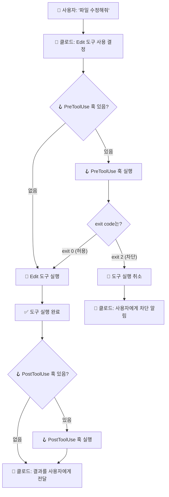

# 도구 호출의 생명주기 🔄

> 클로드가 도구를 한 번 사용할 때, 어떤 일이 벌어질까?

---

## 한 번의 도구 호출, 3단계 여정

클로드가 도구를 사용할 때마다 **항상 같은 순서**로 진행됩니다.

```
💡 비유: 병원 진료

  1️⃣ 접수 (PreToolUse)
     → 보험증 확인, 예약 확인
     → 문제 있으면? 진료 불가! (차단)

  2️⃣ 진료 (도구 실행)
     → 의사가 진찰하고 처방

  3️⃣ 수납 (PostToolUse)
     → 진료 기록 저장, 영수증 발급
     → 이미 진료 끝났으니 취소 불가!
```

---

## 전체 흐름도



---

## 단계별 상세 설명

### 1단계: PreToolUse (도구 사용 전) 🚪

```
시점: 클로드가 도구를 사용하기로 결정한 직후, 실제 실행 직전
━━━━━━━━━━━━━━━━━━━━━━━━━━━━━━━━━━━━━━━━━━━━━━━━━━━━━

  📥 받는 정보:
     CLAUDE_TOOL_NAME  = 사용할 도구 이름
     CLAUDE_TOOL_INPUT = 도구에 보낼 입력값

  📤 할 수 있는 것:
     exit 0 → ✅ "괜찮아, 진행해!"
     exit 2 → 🚫 "안 돼, 차단!"
     echo   → 💬 클로드에게 메시지 전달
```

**exit code의 의미:**

| exit code | 의미 | 결과 |
|-----------|------|------|
| `exit 0` | 허용 | 도구가 정상적으로 실행됨 |
| `exit 2` | 차단 | 도구 실행이 취소됨 |
| `exit 1` | 에러 | 훅 자체에 문제가 생김 (도구는 실행됨) |

> ⚠️ **중요:** `exit 1`은 "차단"이 아니라 "에러"입니다!
> 차단하고 싶으면 반드시 `exit 2`를 사용하세요.

### 2단계: 도구 실행 🔧

```
시점: PreToolUse를 통과한 후
━━━━━━━━━━━━━━━━━━━━━━━━━━━

  클로드가 실제로 도구를 실행합니다.
  예: 파일 쓰기, 파일 수정, 터미널 명령어 실행 등

  이 단계는 훅이 관여하지 않습니다.
  도구가 자기 할 일을 합니다.
```

### 3단계: PostToolUse (도구 사용 후) 📝

```
시점: 도구 실행이 완료된 직후
━━━━━━━━━━━━━━━━━━━━━━━━━━

  📥 받는 정보:
     CLAUDE_TOOL_NAME   = 사용된 도구 이름
     CLAUDE_TOOL_INPUT  = 도구에 보냈던 입력값
     CLAUDE_TOOL_RESULT = 도구 실행 결과 ← 🆕 이건 여기서만!

  📤 할 수 있는 것:
     echo   → 💬 클로드에게 메시지 전달
     기록   → 📋 로그 파일에 저장
     알림   → 🔔 외부 서비스에 알림 전송

  ❌ 할 수 없는 것:
     차단   → 이미 실행 끝났으니 되돌릴 수 없음!
```

---

## 실제 시나리오로 이해하기

### 시나리오: 클로드에게 "hello.txt에 인사말 써줘" 요청

```
1️⃣ 사용자 → 클로드: "hello.txt에 인사말 써줘"

2️⃣ 클로드: Write 도구를 사용하기로 결정
   CLAUDE_TOOL_NAME = "Write"
   CLAUDE_TOOL_INPUT = {"file_path": "hello.txt", "content": "안녕하세요!"}

3️⃣ PreToolUse 훅 실행 (만약 있다면)
   → 훅이 CLAUDE_TOOL_INPUT을 확인
   → "hello.txt? 괜찮아!" → exit 0

4️⃣ Write 도구 실행
   → hello.txt 파일에 "안녕하세요!" 작성

5️⃣ PostToolUse 훅 실행 (만약 있다면)
   → 훅이 CLAUDE_TOOL_RESULT 확인
   → tool-log.txt에 기록 남김

6️⃣ 클로드 → 사용자: "hello.txt에 인사말을 작성했습니다!"
```

### 시나리오: 보호된 파일을 수정하려고 할 때

```
1️⃣ 사용자 → 클로드: "important.txt 수정해줘"

2️⃣ 클로드: Edit 도구를 사용하기로 결정
   CLAUDE_TOOL_NAME = "Edit"
   CLAUDE_TOOL_INPUT = {"file_path": "important.txt", ...}

3️⃣ PreToolUse 훅 실행
   → 훅이 CLAUDE_TOOL_INPUT에서 "important.txt" 발견!
   → "이 파일은 수정 금지!" → exit 2 🚫

4️⃣ 도구 실행 취소됨 ❌
   → Edit 도구는 실행되지 않음

5️⃣ PostToolUse 훅 실행되지 않음
   → 도구가 실행되지 않았으니까!

6️⃣ 클로드 → 사용자: "이 파일은 수정할 수 없습니다"
```

---

## 핵심 정리

```
🔄 생명주기 한 줄 요약
━━━━━━━━━━━━━━━━━━━━━━━━━━━━━━━━━━━

  Pre (확인) → 도구 실행 → Post (기록)

  ✅ Pre에서 차단하면 → 도구 실행 안 됨
  ✅ Post에서는 차단 불가 → 기록/알림 용도
  ✅ exit 0 = 허용, exit 2 = 차단, exit 1 = 에러
  ✅ CLAUDE_TOOL_RESULT는 Post에서만 사용 가능
```
