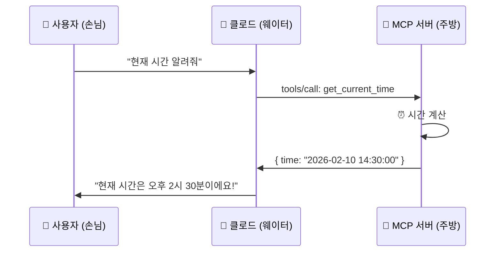

# MCP 서버 — 클로드에게 새로운 능력을! ⭐⭐⭐

> 클로드가 슬랙, 깃허브, 파일 시스템을 직접 다룬다면? 🔌

여러분의 스마트폰에는 기본 앱(전화, 메시지, 카메라)이 있죠.
하지만 **앱 스토어**에서 새 앱을 설치하면? 카카오톡으로 채팅하고, 인스타그램으로 사진을 올리고, 배달앱으로 음식을 시킬 수 있어요.

**MCP 서버**도 똑같습니다. 클로드(스마트폰)에 **새로운 앱(MCP 서버)을 설치**하면 파일을 읽고, GitHub에서 코드를 관리하고, Slack으로 메시지를 보낼 수 있어요!

```
📱 스마트폰                        🤖 클로드
──────────────                    ──────────────
기본 앱: 전화, 카메라               기본 도구: 코드 작성, 파일 편집
    +                                  +
앱 스토어에서 설치:                 MCP 서버 연결:
├── 카카오톡 (채팅)                ├── Slack 서버 (메시지)
├── 인스타그램 (사진)              ├── GitHub 서버 (코드 관리)
├── 배달의민족 (음식)              ├── 파일시스템 서버 (파일 관리)
└── 게임 앱 (놀이)                └── 커스텀 서버 (내가 만든 기능!)
```

---

## 이런 걸 배워요

- **MCP가 뭔지** — 클로드와 외부 도구를 연결하는 표준 방법 🔌
- **MCP 서버 종류** — 파일시스템, GitHub, Slack 등 주요 서버들 📱
- **직접 연결해보기** — 파일시스템 서버, GitHub 서버 설정 실습 🏪
- **나만의 서버 만들기** — 시간 알려주는 MCP 서버 직접 코딩! ✅

---

## 사전 준비

### 1. Claude Code 기본 사용법

이 튜토리얼은 **상급** 난이도입니다. 먼저 아래 내용을 알고 있어야 해요:

- Claude Code 설치 및 기본 사용법
- 터미널(명령어) 기본 사용법
- Node.js 설치 (커스텀 서버 만들기에 필요)

### 2. Node.js 확인

```bash
# Node.js가 설치되어 있는지 확인
node --version
# v18 이상이면 OK!

# npm도 확인
npm --version
```

---

## MCP란? 🔌

**MCP** = **M**odel **C**ontext **P**rotocol (모델 컨텍스트 프로토콜)

클로드와 외부 도구를 연결하는 **표준 방법**입니다.

USB 허브를 생각해보세요. 노트북에 USB 포트가 하나뿐이어도, USB 허브를 연결하면 마우스, 키보드, 외장하드를 **동시에** 쓸 수 있죠. MCP도 마찬가지예요!

```
🔌 USB 허브                        🔌 MCP
──────────────                    ──────────────
노트북 ─── USB 허브                클로드 ─── MCP 프로토콜
              ├── 마우스                        ├── 파일시스템 서버
              ├── 키보드                        ├── GitHub 서버
              ├── 외장하드                      ├── Slack 서버
              └── 프린터                        └── 커스텀 서버
```

---

## 어떻게 동작할까? 🏪

식당에 비유해볼게요:



| 식당 🍽️ | MCP 🔌 | 설명 |
|----------|---------|------|
| 손님 | 사용자 | 요청하는 사람 |
| 웨이터 | 클로드 (클라이언트) | 요청을 전달하고 결과를 알려줌 |
| 메뉴판 | `tools/list` | 할 수 있는 것들 목록 |
| 주문서 | `tools/call` | 특정 기능 실행 요청 |
| 주방 | MCP 서버 | 실제로 기능을 실행하는 곳 |
| 음식 | 결과 (response) | 실행 결과 |

---

## 학습 순서

| 단계 | 내용 | 파일 |
|------|------|------|
| 0️⃣ | 개념 이해 | [concepts/](./concepts/) |
| 1️⃣ | MCP 기본 이해 | [tutorial/step-01-understand.md](./tutorial/step-01-understand.md) |
| 2️⃣ | 파일시스템 서버 연결 | [tutorial/step-02-filesystem.md](./tutorial/step-02-filesystem.md) |
| 3️⃣ | GitHub 서버 연결 | [tutorial/step-03-github.md](./tutorial/step-03-github.md) |
| 4️⃣ | 나만의 서버 만들기 | [tutorial/step-04-custom.md](./tutorial/step-04-custom.md) |
| 📚 | 참고 자료 | [reference/](./reference/) |
| 🎯 | 도전 과제 | [exercise/](./exercise/) |

---

## 핵심 정리 💡

```
✅ MCP = 클로드에게 새 능력을 추가하는 표준 방법
✅ MCP 서버 = 특정 기능을 제공하는 프로그램 (앱)
✅ MCP 클라이언트 = 기능을 사용하는 쪽 (클로드)
✅ 설정 파일 = .claude/settings.json에서 서버를 관리
✅ 누구나 MCP 서버를 만들 수 있다!
```

> ⚠️ **주의**: MCP 서버는 여러분의 컴퓨터에서 실행되는 프로그램입니다.
> 신뢰할 수 있는 서버만 설치하세요!
