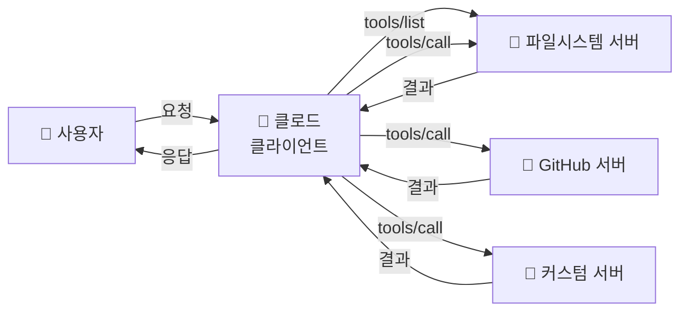

# MCP 아키텍처 — 식당 비유로 이해하기 🍽️

> 주방(서버)에서 음식을 만들고, 웨이터(클로드)가 손님(사용자)에게 전달합니다!

---

## 식당 비유 🍽️

MCP의 구조를 식당에 비유해볼게요:

```
🍽️ 식당                           🔌 MCP
──────────────                    ──────────────
손님 (주문하는 사람)               사용자 (요청하는 사람)
     ↕                                 ↕
웨이터 (주문 전달)                 클로드 = MCP 클라이언트
     ↕                                 ↕
주문 전달 방식 (구두/벨)           Transport (stdin/stdout)
     ↕                                 ↕
주방 (음식 만드는 곳)              MCP 서버 (기능 실행)
     ↕                                 ↕
요리사 (실제 조리)                 도구들 (tools)
```

### 식당의 동작 순서

1. 🧑 **손님**이 메뉴판을 봅니다 → `tools/list` (어떤 도구가 있는지 확인)
2. 🧑 **손님**이 웨이터에게 주문합니다 → 사용자가 클로드에게 요청
3. 🤵 **웨이터**가 주방에 주문서를 전달합니다 → `tools/call` (도구 실행 요청)
4. 👨‍🍳 **주방**에서 음식을 만듭니다 → MCP 서버가 기능 실행
5. 🤵 **웨이터**가 음식을 손님에게 가져옵니다 → 클로드가 결과를 사용자에게 전달

---

## 실제 구조 다이어그램 📐



---

## MCP 서버가 제공하는 3가지 🎁

MCP 서버는 세 가지 종류의 것을 제공할 수 있어요:

| 종류 | 식당 비유 | 설명 | 예시 |
|------|-----------|------|------|
| **Tools** (도구) | 메뉴 🍔 | 실행할 수 있는 기능 | `read_file`, `create_issue` |
| **Resources** (리소스) | 식재료 진열대 🥬 | 읽을 수 있는 데이터 | 파일 목록, DB 스키마 |
| **Prompts** (프롬프트) | 추천 메뉴 ⭐ | 미리 만든 대화 템플릿 | "코드 리뷰해줘" 템플릿 |

### 가장 많이 쓰는 건? → Tools! 🔧

대부분의 MCP 서버는 **Tools(도구)**를 제공합니다.

```
📦 파일시스템 서버의 Tools:
├── read_file      — 파일 읽기
├── write_file     — 파일 쓰기
├── list_directory — 폴더 목록 보기
├── create_directory — 폴더 만들기
├── move_file      — 파일 이동
└── search_files   — 파일 검색
```

---

## Transport (운반 방식) 🚚

클로드와 MCP 서버는 어떻게 메시지를 주고받을까요?

### stdio (표준 입출력) — 가장 일반적

```
클로드 ──stdin──→ MCP 서버 프로세스
클로드 ←─stdout── MCP 서버 프로세스
```

Claude Code에서 MCP 서버를 연결하면, 클로드가 **서버 프로그램을 직접 실행**합니다.
그리고 stdin/stdout 파이프로 JSON 메시지를 주고받아요.

> 💡 식당 비유: 주방이 식당 안에 있는 것! 웨이터가 바로 주방에 말하면 됩니다.

---

## 전체 흐름 예시 📋

"sandbox 폴더의 파일 목록을 보여줘"라고 요청했을 때:

```
1️⃣ 사용자 → 클로드
   "sandbox 폴더의 파일 목록을 보여줘"

2️⃣ 클로드 → 파일시스템 서버 (JSON-RPC)
   {
     "method": "tools/call",
     "params": {
       "name": "list_directory",
       "arguments": { "path": "/path/to/sandbox" }
     }
   }

3️⃣ 파일시스템 서버 → 클로드 (JSON-RPC)
   {
     "result": {
       "content": [{
         "type": "text",
         "text": "hello.txt\ndata.json"
       }]
     }
   }

4️⃣ 클로드 → 사용자
   "sandbox 폴더에는 2개의 파일이 있어요:
    - hello.txt
    - data.json"
```

---

## 핵심 정리 💡

```
✅ 식당 구조 = MCP 구조 (손님→웨이터→주방)
✅ 클로드 = 클라이언트 (요청하는 쪽)
✅ MCP 서버 = 기능을 실행하는 프로그램
✅ Tools = 실행 가능한 기능 (가장 핵심!)
✅ Transport = stdin/stdout으로 JSON 메시지 교환
✅ 여러 서버를 동시에 연결할 수 있다!
```
