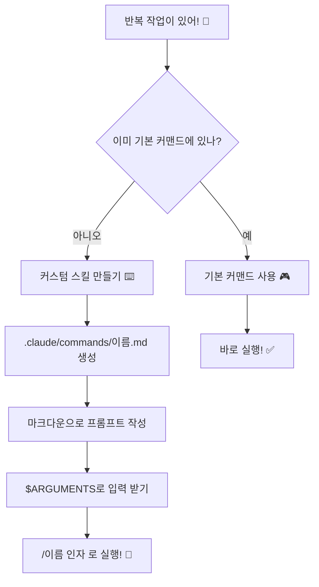

# Skills & 커맨드 ⭐⭐

> 매번 같은 지시를 반복하기 귀찮지 않으세요? 클로드에게 "코드 리뷰해줘, 근데 심각도 표시하고, 줄 번호도 보여주고..." 이걸 매번 타이핑한다고요? 🎮

## 🎯 이 프로젝트에서 배우는 것

1. 클로드 코드에 내장된 **기본 커맨드** 사용법
2. 나만의 **커스텀 스킬** 만드는 법
3. `$ARGUMENTS`로 **유연한 스킬** 만드는 법
4. 실전에서 바로 쓸 수 있는 **실용 스킬 4개**

---

## 🎮 핵심 비유: 게임 단축키

게임을 떠올려보세요!

- **F1** = 도움말, **F5** = 저장 — 게임에 기본으로 있는 단축키죠?
- 그런데 고수들은 **매크로**를 만들어요. Ctrl+Shift+A 한 번이면 복잡한 연속 동작이 실행!

클로드 코드도 **똑같아요!**

- 🎮 **기본 커맨드**: `/help`, `/cost`, `/compact` — 게임의 기본 단축키
- ⌨️ **커스텀 스킬**: `/review`, `/explain` — 내가 만든 매크로

---

## 📊 비교표

| 구분 | 기본 커맨드 | 커스텀 스킬 |
|------|-----------|------------|
| 비유 | 🎮 게임 기본 단축키 | ⌨️ 내가 만든 매크로 |
| 위치 | 클로드에 내장 | `.claude/commands/` 폴더 |
| 수정 | ❌ 불가 | ✅ 자유롭게 |
| 예시 | `/help`, `/cost` | `/review`, `/explain` |
| 입력 | 고정 | `$ARGUMENTS`로 유연하게 |

---

## 🔄 동작 흐름



---

## 📁 프로젝트 구조

```
08-skills-commands/
├── 📖 README.md              ← 지금 보고 있는 파일
├── 📚 concepts/              ← 개념 이해
│   ├── builtin-vs-custom.md  ← 기본 vs 커스텀 비교
│   └── how-skills-work.md    ← 스킬 동작 원리
├── 🎓 tutorial/              ← 따라하기
│   ├── step-01-builtin-tour.md   ← 기본 커맨드 체험
│   ├── step-02-first-skill.md    ← 첫 스킬 만들기
│   └── step-03-advanced.md       ← 실용 스킬 활용
├── 💻 examples/              ← 예제 코드
│   ├── builtin-tour/         ← 기본 커맨드 예제
│   ├── first-skill/          ← 첫 스킬 예제
│   └── useful-skills/        ← 실용 스킬 모음
├── 📋 reference/             ← 레퍼런스
│   ├── builtin-commands.md   ← 기본 커맨드 10개
│   └── troubleshooting.md    ← 문제 해결
└── 🏆 exercise/              ← 연습 문제
    ├── README.md             ← 3가지 미션
    └── .claude/commands/     ← 빈 템플릿
```

---

## 🚀 시작하기

### 추천 학습 순서

1. **개념 잡기** → `concepts/` 폴더의 문서 읽기
2. **따라하기** → `tutorial/` 폴더의 스텝 순서대로
3. **예제 보기** → `examples/` 폴더에서 실제 코드 확인
4. **도전하기** → `exercise/` 폴더의 미션 수행

### 준비물

- 클로드 코드가 설치된 터미널
- 텍스트 편집기 (VS Code 추천)
- 호기심 🧠

---

## 💡 핵심 정리

| 번호 | 핵심 내용 |
|------|----------|
| 1 | 기본 커맨드는 클로드에 내장된 단축키 — 바로 쓸 수 있어요 |
| 2 | 커스텀 스킬은 `.claude/commands/`에 마크다운 파일로 만들어요 |
| 3 | `$ARGUMENTS`를 쓰면 실행할 때 값을 넘길 수 있어요 |
| 4 | 한 번 만들면 `/이름`으로 언제든 재사용! |
| 5 | 팀원과 공유하면 모두가 같은 품질로 작업 가능 |

> 🎮 **기억하세요**: 반복하는 건 매크로로! 클로드에게 반복 지시하는 건 스킬로!
