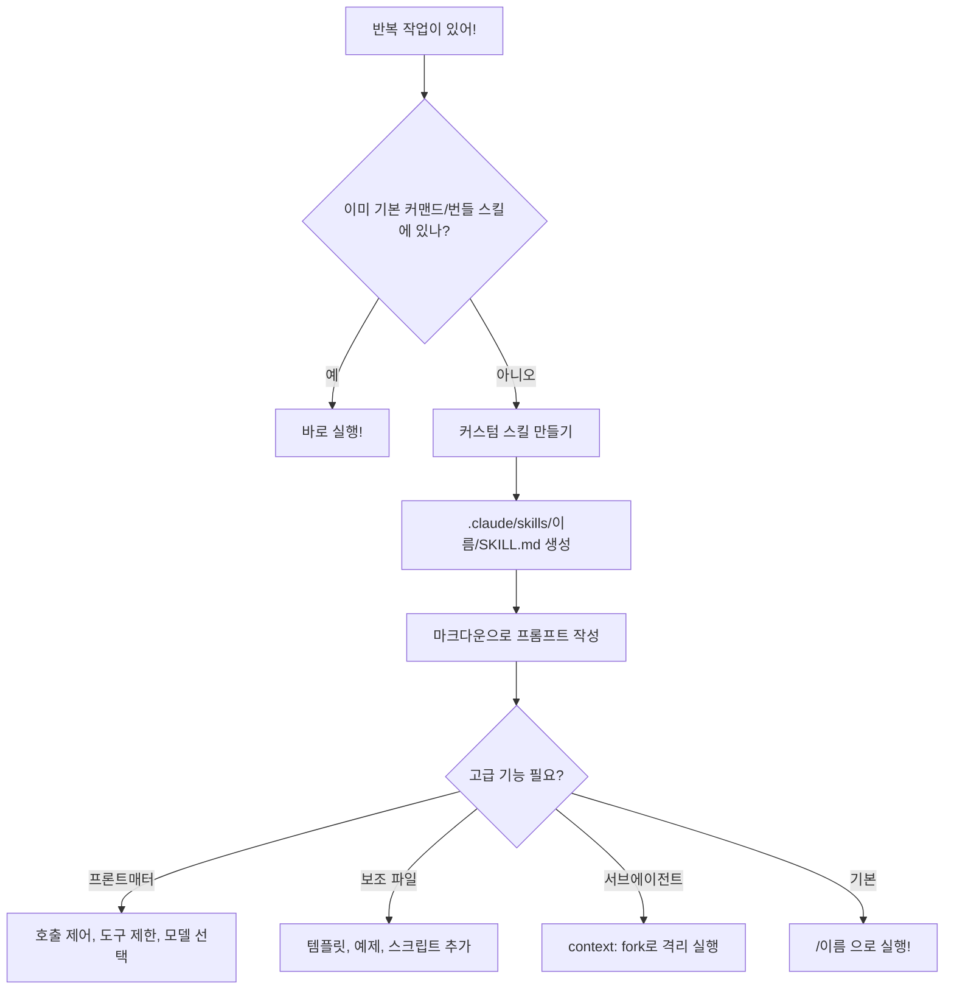

# Skills & 커맨드 ⭐⭐

> 매번 같은 지시를 반복하기 귀찮지 않으세요? 클로드에게 "코드 리뷰해줘, 근데 심각도 표시하고, 줄 번호도 보여주고..." 이걸 매번 타이핑한다고요?

## 이 프로젝트에서 배우는 것

1. 클로드 코드에 내장된 **기본 커맨드** 사용법
2. 나만의 **커스텀 스킬** 만드는 법 (SKILL.md 디렉토리 구조)
3. `$ARGUMENTS`와 **프론트매터**로 유연한 스킬 만드는 법
4. **서브에이전트 실행**, **동적 컨텍스트 주입** 등 고급 기능
5. 실전에서 바로 쓸 수 있는 **실용 스킬** 예제

---

## 핵심 비유: 게임 단축키

게임을 떠올려보세요!

- **F1** = 도움말, **F5** = 저장 -- 게임에 기본으로 있는 단축키죠?
- 그런데 고수들은 **매크로**를 만들어요. Ctrl+Shift+A 한 번이면 복잡한 연속 동작이 실행!

클로드 코드도 **똑같아요!**

- 기본 커맨드: `/help`, `/cost`, `/compact` -- 게임의 기본 단축키
- 번들 스킬: `/simplify`, `/batch`, `/debug` -- 기본 제공 매크로
- 커스텀 스킬: `/review`, `/explain` -- 내가 만든 매크로

---

## 비교표

| 구분 | 기본 커맨드 | 번들 스킬 | 커스텀 스킬 |
|------|-----------|----------|------------|
| 비유 | 게임 기본 단축키 | 기본 제공 매크로 | 내가 만든 매크로 |
| 위치 | 클로드에 내장 | 클로드에 내장 | `.claude/skills/` 폴더 |
| 수정 | 불가 | 불가 | 자유롭게 |
| 예시 | `/help`, `/cost` | `/simplify`, `/batch` | `/review`, `/explain` |
| 입력 | 고정 | 텍스트 전달 가능 | `$ARGUMENTS`로 유연하게 |

---

## 스킬 시스템 진화: commands -> skills

> v2.1.70 기준으로 `.claude/commands/`는 **레거시(은퇴)** 포맷입니다.
> 기존 파일은 계속 동작하지만, 새로 만들 때는 `.claude/skills/`를 사용하세요.

```
이전 (레거시)                    현재 (권장)
-----------                    -----------
.claude/commands/review.md     .claude/skills/review/SKILL.md
단일 파일                       디렉토리 (보조 파일 포함 가능)
자체 포맷                       Agent Skills 오픈 표준
```

---

## 동작 흐름


```mermaid
flowchart TD
    A["반복 작업이 있어!"] --> B{"이미 기본 커맨드/번들 스킬에 있나?"}
    B -->|예| C["바로 실행!"]
    B -->|아니오| D["커스텀 스킬 만들기"]
    D --> E[".claude/skills/이름/SKILL.md 생성"]
    E --> F["마크다운으로 프롬프트 작성"]
    F --> G{"고급 기능 필요?"}
    G -->|"프론트매터"| H["호출 제어, 도구 제한, 모델 선택"]
    G -->|"보조 파일"| I["템플릿, 예제, 스크립트 추가"]
    G -->|"서브에이전트"| J["context: fork로 격리 실행"]
    G -->|"기본"| K["/이름 으로 실행!"]
```

---

## 프로젝트 구조

```
08-skills-commands/
├── README.md                     <- 지금 보고 있는 파일
├── concepts/
│   ├── builtin-vs-custom.md      <- 기본 vs 번들 vs 커스텀 비교
│   ├── how-skills-work.md        <- SKILL.md 구조와 프론트매터
│   └── skill-lifecycle.md        <- 호출 제어, 은퇴, 진화
├── tutorial/
│   ├── step-01-builtin-tour.md   <- 기본 커맨드 + 번들 스킬 체험
│   ├── step-02-first-skill.md    <- 첫 SKILL.md 만들기
│   ├── step-03-advanced.md       <- 프론트매터 + 보조 파일
│   └── step-04-subagent.md       <- context:fork + 동적 주입
├── examples/
│   ├── basic-skill/              <- 기본 스킬 예제 (SKILL.md)
│   ├── advanced-skill/           <- 프론트매터 활용 예제
│   └── subagent-skill/           <- 서브에이전트 실행 예제
├── reference/
│   ├── frontmatter-fields.md     <- 프론트매터 필드 레퍼런스
│   ├── string-substitutions.md   <- $ARGUMENTS, ${CLAUDE_SKILL_DIR} 등
│   └── troubleshooting.md        <- 문제 해결
└── exercise/
    ├── README.md                 <- 3가지 미션
    └── .claude/skills/           <- 빈 템플릿
```

---

## 시작하기

### 추천 학습 순서

1. **개념 잡기** -> `concepts/` 폴더의 문서 읽기
2. **따라하기** -> `tutorial/` 폴더의 스텝 순서대로
3. **예제 보기** -> `examples/` 폴더에서 실제 코드 확인
4. **도전하기** -> `exercise/` 폴더의 미션 수행

### 준비물

- 클로드 코드 v2.1.70+가 설치된 터미널
- 텍스트 편집기 (VS Code 추천)
- 호기심

---

## 핵심 정리

| 번호 | 핵심 내용 |
|------|----------|
| 1 | 기본 커맨드는 클로드에 내장된 단축키 -- 바로 쓸 수 있어요 |
| 2 | 번들 스킬(`/simplify`, `/batch` 등)은 기본 제공 매크로 |
| 3 | 커스텀 스킬은 `.claude/skills/이름/SKILL.md`로 만들어요 (레거시: `commands/`) |
| 4 | 프론트매터로 호출 제어, 도구 제한, 서브에이전트 실행 가능 |
| 5 | `$ARGUMENTS`, `${CLAUDE_SKILL_DIR}`, `` !`command` ``로 동적 스킬 가능 |
| 6 | `context: fork`로 격리된 서브에이전트에서 스킬 실행 가능 |
| 7 | 팀원과 공유하면 모두가 같은 품질로 작업 가능 |

> 기억하세요: 반복하는 건 매크로로! 클로드에게 반복 지시하는 건 스킬로!
