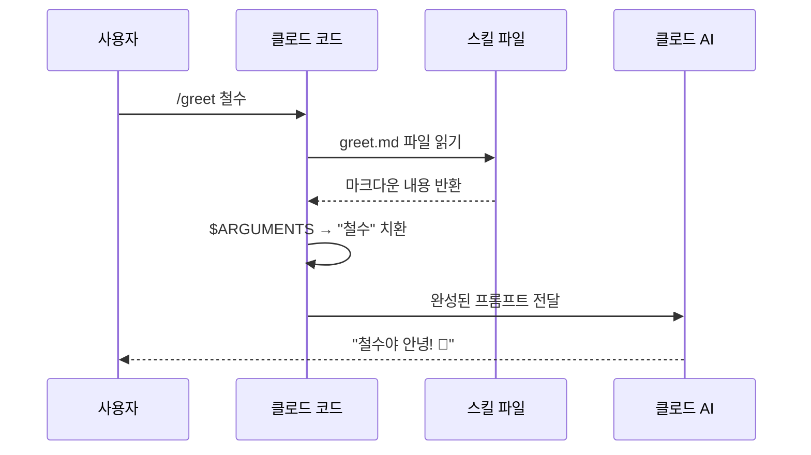

# 스킬은 어떻게 동작할까? 🔧

> 스킬 파일은 그냥 마크다운이에요! 마법 같지만, 원리는 아주 단순해요.

---

## 📝 스킬 = 마크다운 파일

커스텀 스킬의 정체는 **그냥 마크다운(.md) 파일**이에요.

```markdown
# .claude/commands/greet.md

사용자에게 친근하게 인사해주세요.

인사 대상: $ARGUMENTS

요구사항:
- 반말로 친근하게
- 이모지 포함
```

> 💡 **비유**: 레시피 카드에 요리법을 적어두는 것과 같아요!
> 요리사(클로드)가 카드를 읽고 그대로 따라합니다.

---

## 🔄 `$ARGUMENTS` = 사용자 입력

`$ARGUMENTS`는 특별한 자리 표시자(placeholder)예요.
사용자가 `/커맨드` 뒤에 입력한 내용이 여기에 들어가요!

### 동작 예시

**스킬 파일** (`greet.md`):
```markdown
사용자에게 친근하게 인사해주세요.
인사 대상: $ARGUMENTS
```

**사용자가 입력**:
```
/greet 철수
```

**클로드가 실제로 받는 내용**:
```markdown
사용자에게 친근하게 인사해주세요.
인사 대상: 철수
```

> 🎮 **비유**: 자판기에 동전을 넣으면 음료가 나오듯이,
> `$ARGUMENTS` 자리에 입력값이 "쏙" 들어가는 거예요!

### 더 많은 예시

| 스킬 | 사용자 입력 | $ARGUMENTS 값 |
|------|-----------|---------------|
| `greet.md` | `/greet 철수` | `철수` |
| `review.md` | `/review app.js` | `app.js` |
| `explain.md` | `/explain utils/helper.ts` | `utils/helper.ts` |
| `summarize.md` | `/summarize README.md` | `README.md` |

---

## ⚙️ 실행 과정 (단계별)



### 텍스트로 보기

```
1️⃣ 사용자: /greet 철수
2️⃣ 클로드 코드: .claude/commands/greet.md 파일을 찾아서 읽음
3️⃣ 클로드 코드: $ARGUMENTS를 "철수"로 바꿈
4️⃣ 클로드 AI: 완성된 프롬프트를 받아서 실행
5️⃣ 결과: "철수야 안녕! 👋 오늘도 좋은 하루 보내!"
```

---

## 📐 스킬 파일 작성 규칙

### 1. 파일 이름 = 커맨드 이름

```
.claude/commands/review.md  → /review
.claude/commands/explain.md → /explain
.claude/commands/my-tool.md → /my-tool
```

> ⚠️ 파일 이름에 공백 넣지 마세요! 하이픈(`-`)을 사용하세요.

### 2. 내용은 자유 형식

마크다운이니까 뭐든 쓸 수 있어요:

```markdown
# 제목도 OK
- 리스트도 OK
- **볼드**도 OK

코드 블록도 OK:
```js
console.log("hello");
```​

표도 OK:
| 이것 | 저것 |
|------|------|
| a    | b    |
```

### 3. `$ARGUMENTS`는 대문자로

```markdown
✅ 올바른: $ARGUMENTS
❌ 틀린: $arguments, $Arguments, $args
```

### 4. 명확한 지시를 적기

클로드가 잘 이해할 수 있도록 **구체적으로** 적어요:

```markdown
❌ 나쁜 예:
코드를 봐주세요: $ARGUMENTS

✅ 좋은 예:
다음 파일의 코드를 리뷰해주세요: $ARGUMENTS

리뷰 기준:
1. 버그가 있는지 확인
2. 성능 문제가 있는지 확인
3. 가독성은 괜찮은지 확인

출력 형식:
- 각 문제마다 심각도 표시 (🔴🟡🟢)
- 수정 제안 포함
```

---

## 🗂️ 파일 구조 다시 보기

```
내-프로젝트/
├── .claude/
│   └── commands/           ← 스킬 파일들이 사는 곳!
│       ├── review.md       ← /review
│       ├── explain.md      ← /explain
│       ├── test-gen.md     ← /test-gen
│       └── summarize.md    ← /summarize
├── src/
│   └── app.js
└── package.json
```

---

## 💡 핵심 정리

| 번호 | 핵심 |
|------|------|
| 1 | 스킬 파일 = **그냥 마크다운** (특별한 문법 없음) |
| 2 | `$ARGUMENTS` = 사용자가 커맨드 뒤에 입력한 내용 |
| 3 | 파일 이름이 곧 커맨드 이름 (`review.md` → `/review`) |
| 4 | 클로드가 마크다운을 읽고 그대로 실행 |
| 5 | 구체적으로 적을수록 결과가 좋아짐 |

> 🔧 **기억하세요**: 스킬 = 레시피 카드, $ARGUMENTS = 재료, 클로드 = 요리사!
