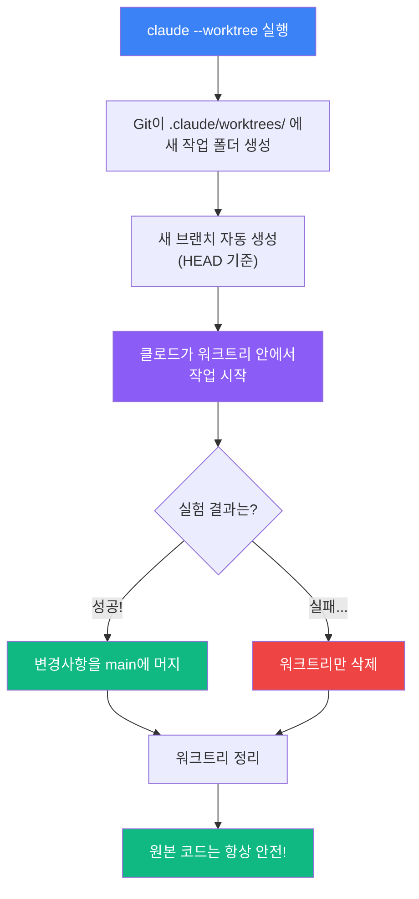

# Worktree — 안전한 실험 공간 만들기 ⭐⭐

> 과학 실험실에서는 위험한 실험을 교실 책상이 아닌 **별도의 실험대**에서 하죠?

코드를 고치다가 "이거 완전히 망하면 어떡하지?" 걱정한 적 있나요?
파일을 잔뜩 수정했는데 원래대로 돌아가고 싶을 때는요?

**Worktree(워크트리)**는 코드의 **실험실**입니다.
원래 코드는 안전하게 책상 위에 두고, 실험실에서 마음껏 시도해볼 수 있어요!

---

## 핵심 비유: 과학 실험실

```
나의 책상 (= main 코드)              실험실 (= worktree)
━━━━━━━━━━━━━━━━━━━━━              ━━━━━━━━━━━━━━━━━━━━

  ┌──────────────┐                   ┌──────────────┐
  │  보고서.txt   │                   │  보고서.txt   │  ← 복사본!
  │  자료.csv     │                   │  자료.csv     │
  │  분석.py      │                   │  분석.py      │
  └──────────────┘                   └──────────────┘

  손대지 않음!                        여기서 마음껏 실험!
  안전하게 보존                       실패해도 OK
```

**Worktree = 코드를 복사한 별도의 실험 공간!**

- 내 책상(main) → 원본 코드가 안전하게 보관됨
- 실험실(worktree) → 복사본에서 자유롭게 실험
- 실험 성공 → 결과를 책상으로 가져오기
- 실험 실패 → 실험실만 정리하면 끝!

---

## 일반 브랜치 전환 vs 워크트리

| 비교 항목 | 일반 브랜치 전환 (`git checkout`) | 워크트리 (`--worktree`) |
|-----------|--------------------------------|----------------------|
| 비유 | 책상 위 서류를 치우고 다른 서류 펼치기 | 옆에 실험대를 하나 더 만들기 |
| 작업 폴더 | **1개** (전환하며 사용) | **2개 이상** (동시에 존재) |
| 전환 속도 | 느림 (파일 교체 필요) | 빠름 (이미 따로 존재) |
| 동시 작업 | 불가 (한 번에 하나만) | 가능 (각 폴더에서 독립 작업) |
| 위험도 | 변경 사항 충돌 가능 | 완전 격리, 안전 |
| 정리 | 브랜치 삭제만 | 워크트리 폴더 제거 |

---

## 워크트리 동작 흐름



---

## 프로젝트 구조

```
09-worktree/
├── README.md                              ← 지금 보고 있는 파일
├── concepts/
│   ├── what-is-worktree.md                ← 워크트리란?
│   └── worktree-vs-branch.md              ← 브랜치 vs 워크트리 비교
├── tutorial/
│   ├── step-01-first-worktree.md          ← 첫 워크트리 만들기
│   ├── step-02-experiment.md              ← 안전한 실험하기
│   └── step-03-agent-isolation.md         ← 에이전트 격리 실행
└── examples/
    ├── basic-worktree/                    ← 기본 워크트리 체험
    ├── worktree-hooks/                    ← 훅으로 자동화
    └── isolated-agents/                   ← 에이전트 격리 예제
```

---

## 이런 걸 배워요

- **워크트리가 뭔지** — Git이 만들어주는 별도의 작업 공간
- **왜 안전한지** — 원본 코드와 완전히 분리되어 실험 가능
- **직접 만들어보기** — `claude --worktree`로 실험실 만들기
- **에이전트 격리** — 여러 에이전트가 각자의 워크트리에서 독립 작업

---

## 학습 순서

### 개념 이해하기

| # | 문서 | 설명 |
|---|------|------|
| 1 | [워크트리란 무엇인가?](concepts/what-is-worktree.md) | 과학 실험실 비유, 핵심 개념 |
| 2 | [브랜치 전환 vs 워크트리](concepts/worktree-vs-branch.md) | 두 방식의 차이, 장단점 |

### 따라하기 튜토리얼

| 단계 | 문서 | 난이도 | 설명 |
|------|------|--------|------|
| 1 | [첫 워크트리 만들기](tutorial/step-01-first-worktree.md) | ⭐ | `claude -w`로 시작하기 |
| 2 | [안전한 실험하기](tutorial/step-02-experiment.md) | ⭐⭐ | 과감하게 코드 바꿔보기 |
| 3 | [에이전트 격리 실행](tutorial/step-03-agent-isolation.md) | ⭐⭐ | 에이전트마다 별도 공간 |

### 실습 예제

| 예제 | 난이도 | 설명 |
|------|--------|------|
| [기본 워크트리 체험](examples/basic-worktree/) | ⭐ | 워크트리 생성/확인/정리 |
| [워크트리 훅](examples/worktree-hooks/) | ⭐⭐ | 생성/제거 시 자동 스크립트 |
| [에이전트 격리](examples/isolated-agents/) | ⭐⭐ | 여러 에이전트 동시 작업 |

---

## 다루는 기능 (v2.1.49~50)

| 기능 | 버전 | 설명 |
|------|------|------|
| `--worktree` (`-w`) 플래그 | v2.1.49 | 클로드를 격리된 워크트리에서 실행 |
| `isolation: "worktree"` | v2.1.49~50 | 서브에이전트를 워크트리에서 격리 실행 |
| `WorktreeCreate` 훅 | v2.1.50 | 워크트리 생성 시 자동 실행 |
| `WorktreeRemove` 훅 | v2.1.50 | 워크트리 삭제 시 자동 실행 |
| `background: true` | v2.1.49 | 에이전트를 백그라운드에서 실행 |

---

## 핵심 정리

```
워크트리 한 줄 요약
━━━━━━━━━━━━━━━━━━━━━━━━━━━━━━━━━━━━━━━━━━━━

  원본 코드를 안전하게 두고, 복사본에서 실험하는 기능!

  실행: claude --worktree  (또는 claude -w)
  위치: .claude/worktrees/ 에 생성됨
  핵심: 실험 성공 → 머지, 실패 → 폴더만 삭제
  격리: isolation: "worktree"로 에이전트도 격리 가능
```

> **참고:** 워크트리는 **Git 저장소** 안에서만 사용할 수 있습니다.
> 프로젝트가 `git init`으로 초기화되어 있어야 해요!
