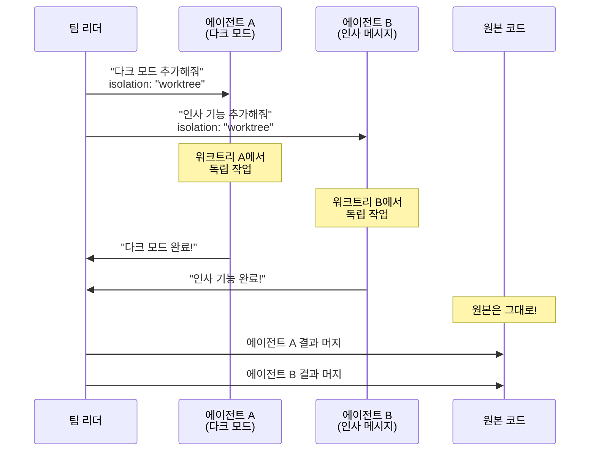

# 에이전트 격리 예제 ⭐⭐

> 두 에이전트가 각자의 워크트리에서 다른 기능을 동시에 개발합니다.

---

## 시나리오

간단한 웹 앱이 있습니다.
두 가지 기능을 **동시에** 추가하고 싶어요:

- **기능 A:** 다크 모드 테마 추가
- **기능 B:** 사용자 인사 메시지 추가

문제: 두 에이전트가 같은 파일(`index.html`, `styles.css`)을 수정해야 합니다.
해결: `isolation: "worktree"`로 각 에이전트를 격리합니다.

---

## 프로젝트 구조

시작 전의 프로젝트:

```
my-webapp/
├── index.html       ← 메인 페이지
├── styles.css       ← 스타일시트
└── app.js           ← 앱 로직
```

**index.html:**

```html
<!DOCTYPE html>
<html>
<head>
  <link rel="stylesheet" href="styles.css">
</head>
<body>
  <h1>My Web App</h1>
  <p>Welcome!</p>
  <script src="app.js"></script>
</body>
</html>
```

**styles.css:**

```css
body {
  font-family: sans-serif;
  background: white;
  color: black;
}
```

**app.js:**

```javascript
console.log('App started');
```

---

## 에이전트 격리 실행

### Task 도구로 에이전트 생성

팀 리더(또는 사용자)가 두 에이전트를 생성합니다:

```
에이전트 A (다크 모드 담당):
  prompt: |
    styles.css에 다크 모드 테마를 추가해줘.
    body에 .dark-mode 클래스가 있으면 어두운 배경에 밝은 글자가 되도록.
    index.html에 테마 전환 버튼도 추가해줘.
  isolation: "worktree"
```

```
에이전트 B (인사 메시지 담당):
  prompt: |
    app.js에서 사용자 이름을 입력받아 인사 메시지를 표시하는 기능을 추가해줘.
    index.html에 이름 입력 필드와 인사 버튼을 추가해줘.
  isolation: "worktree"
```

### 실행 후 폴더 구조

```
my-webapp/
├── .claude/
│   └── worktrees/
│       ├── agent-a-dark/                ← 에이전트 A 전용 공간
│       │   ├── index.html               (테마 전환 버튼 추가됨)
│       │   ├── styles.css               (다크 모드 CSS 추가됨)
│       │   └── app.js                   (테마 전환 로직 추가됨)
│       │
│       └── agent-b-greet/               ← 에이전트 B 전용 공간
│           ├── index.html               (이름 입력 필드 추가됨)
│           ├── styles.css               (인사 영역 스타일 추가됨)
│           └── app.js                   (인사 기능 추가됨)
│
├── index.html                           ← 원본 (변경 없음!)
├── styles.css                           ← 원본 (변경 없음!)
└── app.js                               ← 원본 (변경 없음!)
```

---

## 각 에이전트의 작업 결과

### 에이전트 A의 워크트리 (다크 모드)

**styles.css:**

```css
body {
  font-family: sans-serif;
  background: white;
  color: black;
  transition: background 0.3s, color 0.3s;
}

body.dark-mode {
  background: #1a1a2e;
  color: #eee;
}
```

**index.html (변경 부분):**

```html
<button id="theme-toggle">테마 전환</button>
```

### 에이전트 B의 워크트리 (인사 메시지)

**app.js:**

```javascript
console.log('App started');

function greetUser() {
  const name = document.getElementById('user-name').value;
  document.getElementById('greeting').textContent = `안녕하세요, ${name}님!`;
}
```

**index.html (변경 부분):**

```html
<input type="text" id="user-name" placeholder="이름을 입력하세요">
<button onclick="greetUser()">인사하기</button>
<p id="greeting"></p>
```

---

## 작업 흐름



---

## 결과 합치기

두 에이전트가 모두 끝나면, 리더가 결과를 검토하고 원본에 반영합니다.

```bash
# 에이전트 A의 변경사항 머지
git merge worktree/agent-a-dark

# 에이전트 B의 변경사항 머지
git merge worktree/agent-b-greet
```

> **충돌 가능성:** 두 에이전트가 같은 파일의 같은 부분을 수정했다면 머지 시 충돌이 생길 수 있습니다.
> 이때는 수동으로 해결하거나, 클로드에게 충돌 해결을 요청하면 됩니다.

---

## 핵심 정리

| 항목 | 설명 |
|------|------|
| **목적** | 여러 에이전트가 충돌 없이 동시 작업 |
| **설정** | `isolation: "worktree"`를 Task 도구에 추가 |
| **저장 위치** | `.claude/worktrees/` 아래에 에이전트별 폴더 |
| **원본 보호** | 에이전트들이 뭘 해도 원본은 안전 |
| **결과 반영** | 작업 완료 후 `git merge`로 원본에 합치기 |

---

## 조합 예시: 배경 실행 + 격리

시간이 오래 걸리는 작업을 백그라운드로 격리 실행:

```
에이전트 C (전체 테스트):
  prompt: "모든 테스트를 실행하고 결과를 보고해줘"
  isolation: "worktree"
  background: true
```

- `isolation: "worktree"` — 테스트가 원본에 영향 없음
- `background: true` — 결과를 기다리지 않고 다른 작업 가능

---

## 관련 문서

- [워크트리란 무엇인가?](../../concepts/what-is-worktree.md) — 워크트리 기본 개념
- [워크트리 훅](../worktree-hooks/) — 생성/삭제 시 자동 스크립트
- [Agent Teams 프로젝트](../../../05-agent-teams/README.md) — 에이전트 팀 기본 학습
