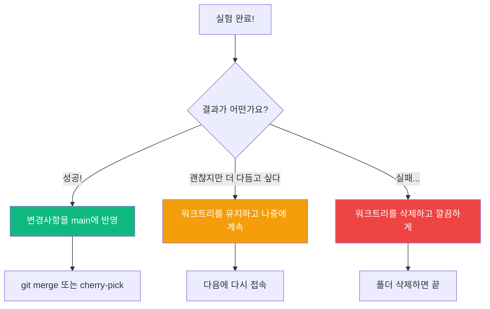

# Step 2 — 안전한 실험하기 ⭐⭐

> 워크트리에서는 뭘 해도 괜찮습니다. 폭발해도 원본은 무사해요!

---

## 왜 "안전한" 실험인가요?

보통 코드를 수정할 때는 조심스럽습니다.
"이거 지우면 큰일 나는 거 아냐?" 하고 걱정하죠.

하지만 워크트리에서는 걱정할 필요가 없습니다.

```
걱정 없는 실험
━━━━━━━━━━━━━━

  원본 코드 → 책상 위에 안전하게 보관 중
  워크트리  → 실험실에서 마음껏!

  파일 삭제? OK!
  코드 전면 수정? OK!
  폴더 구조 변경? OK!

  실패하면? 실험실(워크트리)만 정리하면 끝!
```

---

## 실습: 과감한 실험

### 준비: 워크트리 만들기

```bash
cd my-project
claude -w
```

### 실험 1: 파일 이름 바꾸기

클로드에게 과감한 요청을 해봅시다:

```
> 모든 파일 이름을 영어에서 한글로 바꿔줘.
> 예: main.js → 메인.js, utils.js → 도구.js
```

원본 폴더에서 확인:

```bash
# 새 터미널에서
ls my-project/src/
```

```
main.js  utils.js  config.js     ← 원본은 그대로!
```

워크트리에서 확인:

```bash
ls my-project/.claude/worktrees/gentle-river/src/
```

```
메인.js  도구.js  설정.js         ← 워크트리만 변경됨!
```

### 실험 2: 코드 전면 재작성

더 과감하게 가봅시다:

```
> calculateTotal 함수를 완전히 다른 알고리즘으로 다시 작성해줘.
> 기존: for 루프 방식 → 변경: reduce 함수형 방식
```

이런 큰 변경도 워크트리에서라면 안전합니다!

### 실험 3: 의존성 변경

```
> express 대신 fastify로 서버 코드를 전환해줘
```

패키지를 통째로 바꾸는 실험도 가능합니다.

---

## 실험 결과 확인하기

### 방법 1: 터미널에서 직접 비교

```bash
# 원본 파일 내용
cat my-project/src/main.js

# 워크트리 파일 내용
cat my-project/.claude/worktrees/gentle-river/src/메인.js
```

### 방법 2: git diff로 변경 내용 보기

워크트리 폴더에서:

```bash
cd my-project/.claude/worktrees/gentle-river
git diff
```

변경된 모든 내용이 한눈에 보입니다.

---

## 실험 결과 처리하기

실험이 끝나면 세 가지 선택지가 있습니다:



### 선택 1: 성공 — 결과를 반영하기

실험이 잘 됐다면, 워크트리의 변경사항을 원본에 머지합니다:

```bash
# 원본 프로젝트 폴더에서
cd my-project
git merge worktree/gentle-river
```

### 선택 2: 보류 — 나중에 이어서 하기

세션 종료 시 "Keep"을 선택하면 워크트리가 남아있습니다.
나중에 같은 폴더에서 작업을 이어갈 수 있어요.

### 선택 3: 실패 — 깔끔하게 삭제

세션 종료 시 "Remove"를 선택하거나:

```bash
# 수동으로 삭제
git worktree remove .claude/worktrees/gentle-river
```

원본은 처음 그대로입니다. 아무 일도 없었던 것처럼!

---

## 실전 시나리오: 위험한 리팩토링

### 상황

"데이터베이스 접속 코드를 SQLite에서 PostgreSQL로 바꾸고 싶은데,
잘못되면 서비스가 완전히 멈출 수 있다..."

### 워크트리로 안전하게 시도

```bash
# 1. 워크트리에서 시작
claude -w

# 2. 클로드에게 요청
> 데이터베이스 코드를 SQLite에서 PostgreSQL로 전환해줘.
> 모든 쿼리를 PostgreSQL 문법에 맞게 수정하고,
> 접속 설정도 변경해줘.

# 3. 테스트
> 변경된 코드로 테스트를 실행해줘

# 4. 결과에 따라 판단
# 테스트 통과 → 머지
# 테스트 실패 → 삭제하고 다시 시도
```

### 워크트리 없이 했다면?

```
1. main 브랜치에서 코드 수정 시작
2. 수정 중에 다른 팀원이 코드를 가져감
3. 수정이 꼬여서 원복하고 싶은데...
4. 어디까지 수정했는지 기억이 안 남...
5. git stash? git reset? 혼란...
```

---

## 실험할 때 유용한 팁

| 팁 | 설명 |
|-----|------|
| 실험 전에 목표를 정하기 | "이 실험으로 뭘 확인하고 싶은지" 명확하게 |
| 한 번에 하나씩 | 여러 실험을 섞지 말고, 워크트리를 따로 만들기 |
| 자주 확인하기 | 원본과 비교하며 변경 범위 파악 |
| 성공하면 바로 머지 | 미루면 원본과 점점 달라져서 머지가 어려워짐 |

---

## 요약

```
안전한 실험 요약
━━━━━━━━━━━━━━━━

  워크트리에서는 뭘 해도 원본은 안전!

  파일 삭제, 코드 재작성, 구조 변경...
  전부 실험실(워크트리) 안에서만 일어남

  성공 → 머지  |  보류 → 유지  |  실패 → 삭제
```

---

## 다음 단계

워크트리로 혼자 실험하는 건 배웠습니다!
이제 **여러 에이전트**가 각자의 워크트리에서 작업하는 방법을 알아봅시다.

> [Step 3 — 에이전트 격리 실행](step-03-agent-isolation.md)
