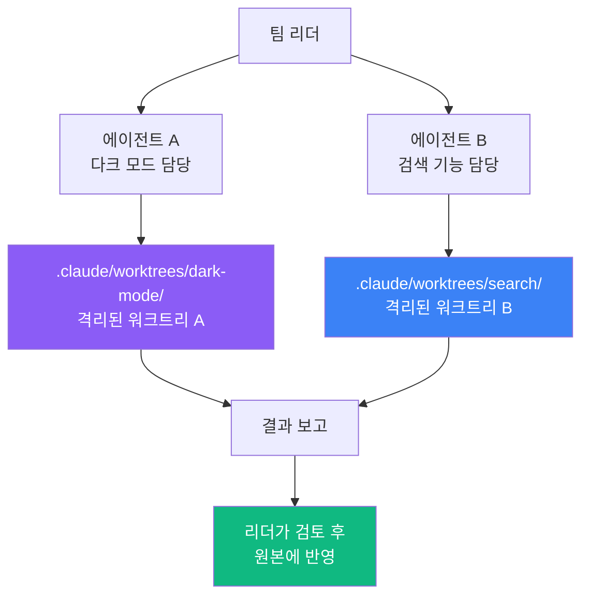

# Step 3 — 에이전트 격리 실행 ⭐⭐

> 여러 에이전트가 서로 방해하지 않고, 각자의 실험실에서 동시에 작업합니다.

---

## 에이전트 격리란?

Agent Teams([프로젝트 05](../../05-agent-teams/README.md))에서 여러 에이전트가 **동시에** 일한다고 배웠죠?

문제가 하나 있습니다:

```
문제 상황: 에이전트 충돌!
━━━━━━━━━━━━━━━━━━━━━━━━━

  에이전트 A: "main.js를 수정할게!"  ─┐
                                      ├→ 같은 파일을 동시에 수정!
  에이전트 B: "main.js를 수정할게!"  ─┘

  결과: 충돌 발생, 한쪽 작업이 덮어씌워짐...
```

**해결:** 각 에이전트에게 **별도의 워크트리**를 줍니다.

```
에이전트 격리 (isolation: "worktree")
━━━━━━━━━━━━━━━━━━━━━━━━━━━━━━━━━━━━

  에이전트 A: "실험실 1에서 main.js 수정"  → .claude/worktrees/실험실1/
  에이전트 B: "실험실 2에서 main.js 수정"  → .claude/worktrees/실험실2/

  결과: 각자의 공간에서 독립 작업. 충돌 없음!
```

---

## 핵심 개념: Task 도구의 isolation 옵션

에이전트를 생성(스폰)할 때 `isolation: "worktree"`를 지정하면,
해당 에이전트는 **자동으로 별도의 워크트리**에서 작업합니다.

```
일반 에이전트                 격리된 에이전트
─────────────                ───────────────

  같은 폴더에서                별도 워크트리에서
  작업                        작업

  ┌──────────┐               ┌──────────┐
  │ 원본     │               │ 복사본 A  │  ← 에이전트 A 전용
  │ 프로젝트  │               └──────────┘
  └──────────┘               ┌──────────┐
  에이전트 A,B 동시 접근       │ 복사본 B  │  ← 에이전트 B 전용
  → 충돌 위험!                └──────────┘
                              충돌 없음!
```

---

## 사용 방법

### 기본 형태

에이전트를 생성할 때 `isolation` 파라미터를 추가합니다:

```
Task 도구 호출 시:

  prompt: "프론트엔드 코드를 리팩토링해줘"
  isolation: "worktree"
```

이렇게 하면 해당 에이전트는 자동으로:
1. 새 워크트리를 생성함
2. 워크트리 안에서 작업을 수행함
3. 작업이 끝나면 결과를 보고함

### 여러 에이전트를 각각 격리

```
에이전트 A (프론트엔드 담당):
  prompt: "React 컴포넌트를 리팩토링해줘"
  isolation: "worktree"

에이전트 B (백엔드 담당):
  prompt: "API 엔드포인트를 최적화해줘"
  isolation: "worktree"

에이전트 C (테스트 담당):
  prompt: "테스트 코드를 보강해줘"
  isolation: "worktree"
```

**결과:**

```
my-project/
├── .claude/
│   └── worktrees/
│       ├── agent-a-xxx/     ← 에이전트 A 전용 공간
│       ├── agent-b-yyy/     ← 에이전트 B 전용 공간
│       └── agent-c-zzz/     ← 에이전트 C 전용 공간
├── src/                     ← 원본 (안전)
└── ...
```

---

## 배경 실행 (background: true)

에이전트를 **백그라운드**에서 실행하면, 결과를 기다리지 않고 다른 작업을 계속할 수 있습니다.

```
백그라운드 에이전트:
  prompt: "전체 테스트를 실행해줘"
  background: true
  isolation: "worktree"
```

| 옵션 | 설명 |
|------|------|
| `background: true` | 결과를 기다리지 않고 바로 다음 작업 진행 |
| `background: false` (기본값) | 에이전트가 끝날 때까지 대기 |

> **조합 활용:** `isolation: "worktree"` + `background: true`를 함께 사용하면,
> 에이전트가 격리된 공간에서 백그라운드로 작업합니다.

---

## 실전 예시: 동시 기능 개발

### 시나리오

웹 앱에 두 가지 기능을 동시에 추가하고 싶습니다:
- 기능 A: 다크 모드 지원
- 기능 B: 검색 기능 추가

### 격리 없이 하면?

```
에이전트 A가 styles.css 수정 중...
에이전트 B도 styles.css를 수정하려고 함...
충돌! 에이전트 A의 작업이 덮어씌워짐!
```

### 격리로 해결

```
팀 리더가 지시:
──────────────

  에이전트 A:
    "다크 모드를 구현해줘"
    isolation: "worktree"

  에이전트 B:
    "검색 기능을 추가해줘"
    isolation: "worktree"
```



각 에이전트가 독립 공간에서 작업하므로 충돌이 없습니다!

---

## 언제 에이전트 격리를 쓸까?

### 사용하면 좋은 경우

| 상황 | 이유 |
|------|------|
| 여러 에이전트가 같은 파일을 수정할 때 | 충돌 방지 |
| 실험적인 변경을 에이전트에게 맡길 때 | 실패해도 안전 |
| 독립적인 기능을 병렬로 개발할 때 | 서로 영향 없음 |
| 대규모 리팩토링을 나눠서 할 때 | 각자 격리 작업 후 합치기 |

### 사용하지 않아도 되는 경우

| 상황 | 이유 |
|------|------|
| 에이전트가 1개뿐일 때 | 충돌 가능성 없음 |
| 읽기 전용 작업 (분석, 검색) | 파일을 수정하지 않음 |
| 순차적으로 작업할 때 | 동시 수정이 아님 |

---

## 전체 흐름 요약

```
에이전트 격리 워크플로우
━━━━━━━━━━━━━━━━━━━━━━

  1. 팀 리더가 에이전트를 생성할 때 isolation: "worktree" 지정
  2. 각 에이전트에게 자동으로 별도 워크트리가 생성됨
  3. 에이전트들이 각자의 워크트리에서 동시에 작업
  4. 작업 완료 후 리더에게 결과 보고
  5. 리더가 결과를 검토하고 원본에 반영
```

---

## 다음으로 읽기

개념과 튜토리얼을 모두 마쳤습니다! 이제 직접 실습해보세요:

- [기본 워크트리 체험](../examples/basic-worktree/) — 직접 만들고 확인하기
- [워크트리 훅](../examples/worktree-hooks/) — 생성/삭제 시 자동화
- [에이전트 격리 예제](../examples/isolated-agents/) — 병렬 에이전트 실습
