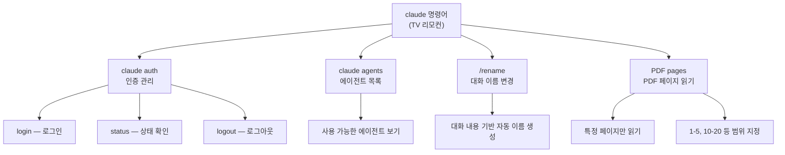
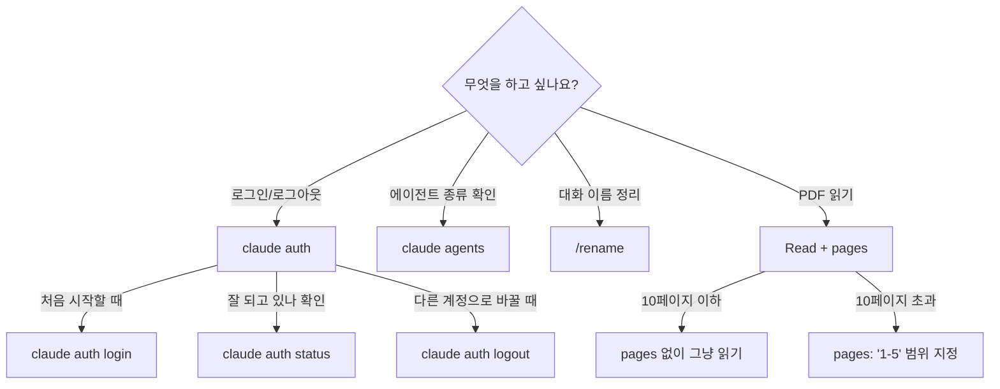

# CLI 마스터 — 터미널에서 클로드 조종하기 ⭐

> TV 리모컨에는 전원, 채널, 볼륨, 입력 전환... 버튼이 여러 개 있죠?
> `claude` 명령어도 마찬가지예요. 하나의 명령어에 **여러 버튼(서브커맨드)**이 숨어 있습니다!

지금까지 우리는 `claude`를 실행해서 대화만 했어요.
하지만 사실 `claude` 뒤에 **서브커맨드**를 붙이면 훨씬 다양한 일을 할 수 있습니다.
로그인, 에이전트 목록 확인, PDF 특정 페이지 읽기까지!

---

## 핵심 비유: TV 리모컨

```
  TV 리모컨                          claude 명령어
  ━━━━━━━━━━━━━━━                    ━━━━━━━━━━━━━━━━━━━━━━━
  ┌─────────────┐                    ┌─────────────────────┐
  │  ⏻ 전원     │  ← 켜고 끄기       │  claude              │  ← 대화 시작
  │  📺 채널     │  ← 채널 변경       │  claude auth login   │  ← 로그인
  │  🔊 볼륨     │  ← 소리 조절       │  claude auth status  │  ← 상태 확인
  │  🔄 입력     │  ← HDMI/USB       │  claude agents       │  ← 에이전트 목록
  │  📋 설정     │  ← 환경설정        │  claude config       │  ← 설정 변경
  └─────────────┘                    └─────────────────────┘

  리모컨 버튼 하나 = 서브커맨드 하나!
```

**리모컨의 전원 버튼**만 누르면 TV가 켜지듯, `claude`만 치면 대화가 시작돼요.
하지만 **채널 버튼**을 누르면 다른 기능이 실행되듯, `claude auth login`을 치면 로그인이 됩니다!

---

## 비교표: 기본 실행 vs 서브커맨드

| 구분 | 기본 실행 | 서브커맨드 |
|------|----------|-----------|
| 비유 | 리모컨 전원 버튼 | 리모컨의 다른 버튼들 |
| 명령어 | `claude` | `claude auth login`, `claude agents` 등 |
| 하는 일 | 대화 시작 | 특정 기능 실행 |
| 대화 필요? | O (대화형) | X (실행하고 끝) |
| 예시 | 코드 질문하기 | 로그인, 상태 확인, 설정 |

---

## 이번에 배울 리모컨 버튼들



---

## 언제 뭘 쓸까?



---

## 프로젝트 구조

```
10-cli-master/
├── README.md                            ← 지금 보고 있는 파일
└── examples/                            ← 따라하기 예제
    ├── auth-flow/                       ← 인증 관리 실습
    │   └── README.md
    ├── agent-list/                      ← 에이전트 & 이름 변경
    │   └── README.md
    └── pdf-reader/                      ← PDF 페이지 읽기
        └── README.md
```

---

## 학습 순서

### 1. 개념 잡기

이 README에서 리모컨 비유와 서브커맨드 개념을 이해하세요.

### 2. 따라하기 예제

| 단계 | 예제 | 난이도 | 설명 |
|------|------|--------|------|
| 1 | [인증 관리](examples/auth-flow/) | ⭐ | 로그인, 상태 확인, 로그아웃 |
| 2 | [에이전트 & 이름](examples/agent-list/) | ⭐ | 에이전트 목록, 대화 이름 자동 생성 |
| 3 | [PDF 읽기](examples/pdf-reader/) | ⭐ | PDF 특정 페이지만 읽기 |

### 준비물

- 클로드 코드가 설치된 터미널
- (PDF 예제용) 아무 PDF 파일 하나
- 호기심!

---

## 핵심 정리

| 번호 | 핵심 내용 |
|------|----------|
| 1 | `claude` 뒤에 서브커맨드를 붙이면 다양한 기능을 쓸 수 있다 |
| 2 | `claude auth`로 로그인/로그아웃/상태 확인이 가능하다 |
| 3 | `claude agents`로 사용 가능한 에이전트를 확인한다 |
| 4 | `/rename`으로 대화 이름을 자동 생성할 수 있다 |
| 5 | PDF를 읽을 때 `pages` 파라미터로 범위를 지정하면 큰 파일도 OK |

```
TV 리모컨 한 줄 요약
━━━━━━━━━━━━━━━━━━━━━━━━━━━━━━━━━━━━━━━━

  claude = 리모컨 전원 버튼 (대화 시작)
  claude auth = 계정 관리 버튼
  claude agents = 에이전트 버튼
  /rename = 이름표 버튼
  pages = PDF 페이지 선택 버튼

  버튼을 알면 리모컨이 쉬워지듯,
  서브커맨드를 알면 클로드가 쉬워진다!
```

> **다음 단계:** [인증 관리](examples/auth-flow/)부터 시작해보세요!
