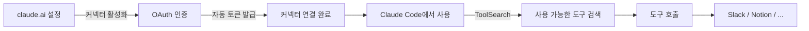

# MCP 커넥터 — 이미 연결된 도구 사용하기 ⭐⭐

> 07-mcp-server에서 MCP 서버를 직접 설정해봤죠? 이번엔 이미 누군가 설정해둔 도구를 바로 쓰는 법을 배워요!

MCP 서버를 직접 설치하고 설정하는 건 마치 **집에 프린터를 직접 사서 드라이버를 설치하는 것**이었어요.
그런데 학교에 가면? **공유 프린터**가 이미 있잖아요. 선생님(관리자)이 한 번 설정해두면, 학생들은 그냥 "인쇄" 버튼만 누르면 됩니다.

**MCP 커넥터**가 바로 그 "학교 공유 프린터"입니다!

```
🏠 집 프린터 (07-mcp-server)          🏫 학교 공유 프린터 (MCP 커넥터)
─────────────────────────             ─────────────────────────
1. 프린터 구매                         1. 학교에 이미 설치됨
2. 드라이버 설치                       2. 선생님이 이미 설정함
3. Wi-Fi 연결 설정                     3. 학생은 "인쇄"만 누르면 됨
4. 용지/잉크 관리                      4. 관리도 학교에서 해줌

→ 내가 다 해야 함                      → 그냥 쓰면 됨!
```

---

## 이런 걸 배워요

- **MCP 커넥터가 뭔지** — claude.ai에서 제공하는 미리 설정된 MCP 서버
- **수동 설정과의 차이** — 07에서 배운 것과 무엇이 다른지
- **커넥터 활성화 방법** — claude.ai에서 클릭 몇 번으로 연결
- **Slack/Notion 연동** — 실제로 메시지 읽고, 페이지 검색하기
- **ToolSearch 사용법** — 사용 가능한 도구를 찾는 방법

---

## 수동 MCP 설정 vs 커넥터

| 비교 항목 | 수동 MCP (07에서 배운 것) | MCP 커넥터 (이번에 배울 것) |
|-----------|--------------------------|---------------------------|
| 설정 방법 | `claude mcp add` + 설정 파일 | claude.ai에서 활성화 |
| 인증 | API 키 직접 발급/관리 | OAuth로 자동 처리 |
| 서버 실행 | 내 컴퓨터에서 실행 | Anthropic이 관리 |
| 업데이트 | 내가 직접 업데이트 | 자동 업데이트 |
| 유연성 | 높음 (커스텀 가능) | 낮음 (제공되는 것만) |
| 난이도 | 중~상 | 하 |
| 비유 | 집 프린터 | 학교 공유 프린터 |

---

## 어떻게 동작할까?



1. **claude.ai에서 커넥터 활성화** — 설정 페이지에서 원하는 서비스 선택
2. **OAuth 인증** — 팝업에서 "허용" 클릭 (API 키 필요 없음!)
3. **Claude Code에서 사용** — ToolSearch로 도구를 찾고 바로 사용
4. **외부 서비스 연동** — Slack 메시지 읽기, Notion 페이지 검색 등

---

## 프로젝트 구조

```
11-mcp-connectors/
├── README.md                              ← 지금 읽고 있는 파일
├── concepts/
│   ├── what-are-connectors.md             ← 커넥터란?
│   └── manual-vs-connector.md             ← 수동 설정 vs 커넥터 비교
├── tutorial/
│   ├── step-01-setup.md                   ← 커넥터 활성화하기
│   ├── step-02-use-connectors.md          ← Slack/Notion 커넥터 사용
│   └── step-03-toolsearch.md              ← ToolSearch로 도구 찾기
└── examples/
    ├── slack-connector/README.md           ← Slack 커넥터 실습
    └── notion-connector/README.md          ← Notion 커넥터 실습
```

---

## 사전 준비

### 선수 과목

이 튜토리얼은 **중급** 난이도입니다. 아래 내용을 먼저 알고 있어야 해요:

| 선수 과목 | 왜 필요한지 |
|-----------|------------|
| [07-mcp-server](../07-mcp-server/) | MCP가 무엇인지, 어떻게 동작하는지 기본 이해 |

> 07을 안 했더라도 개념만 이해하고 있으면 따라올 수 있어요.
> 하지만 "MCP가 뭐야?"가 궁금하다면 07부터 시작하세요!

### 필요한 것

- Claude Code 설치 및 기본 사용법
- claude.ai 계정 (커넥터 설정을 위해)
- Slack 워크스페이스 접근 권한 (Slack 실습용, 선택)
- Notion 워크스페이스 접근 권한 (Notion 실습용, 선택)

---

## 학습 순서

| 단계 | 내용 | 파일 |
|------|------|------|
| 0 | 개념 이해 | [concepts/](./concepts/) |
| 1 | 커넥터 활성화하기 | [tutorial/step-01-setup.md](./tutorial/step-01-setup.md) |
| 2 | Slack/Notion 사용하기 | [tutorial/step-02-use-connectors.md](./tutorial/step-02-use-connectors.md) |
| 3 | ToolSearch로 도구 찾기 | [tutorial/step-03-toolsearch.md](./tutorial/step-03-toolsearch.md) |
| 실습 | Slack 커넥터 실습 | [examples/slack-connector/](./examples/slack-connector/) |
| 실습 | Notion 커넥터 실습 | [examples/notion-connector/](./examples/notion-connector/) |

---

## 핵심 정리

| 개념 | 설명 |
|------|------|
| MCP 커넥터 | claude.ai에서 제공하는 미리 설정된 MCP 서버 |
| OAuth | 사용자 대신 인증을 처리하는 표준 방식 (API 키 불필요) |
| ToolSearch | 커넥터가 제공하는 도구를 검색하는 기능 |
| Deferred Tools | 성능을 위해 필요할 때만 로딩되는 도구 |
| Slack 커넥터 | 채널 읽기, 메시지 검색/발송 |
| Notion 커넥터 | 페이지 검색, 내용 읽기, 댓글 작성 |

> 07-mcp-server에서 "직접 만드는 법"을 배웠다면,
> 이번엔 "이미 만들어진 걸 편하게 쓰는 법"을 배우는 거예요!
