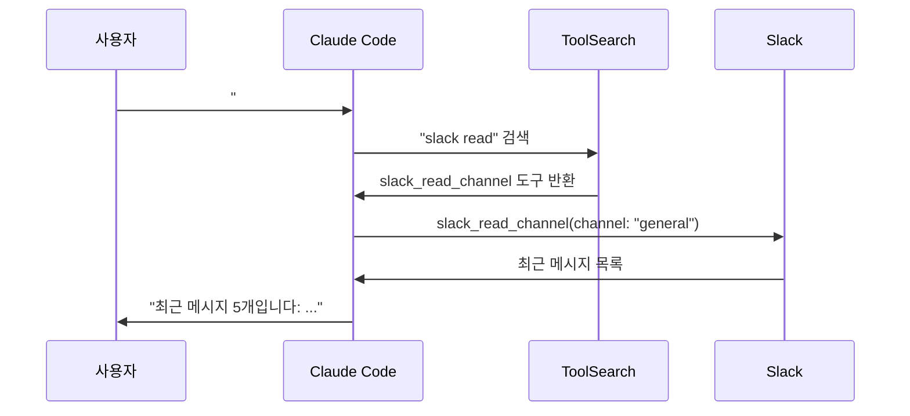

# Step 2: Slack/Notion 커넥터 사용하기

> 연결했으니 이제 실제로 써봅시다!

---

## Slack 커넥터 사용하기

Step 1에서 Slack 커넥터를 활성화했다면, 아래 기능들을 사용할 수 있어요.

### 채널 메시지 읽기

```
사용자: "#general 채널의 최근 메시지 보여줘"
```

클로드가 하는 일:



예상 결과:

```
#general 채널의 최근 메시지입니다:

1. 김철수 (오늘 09:30): "오늘 회의 3시에 할게요"
2. 이영희 (오늘 10:15): "네, 알겠습니다!"
3. 박민수 (오늘 11:00): "회의 자료 공유합니다"
...
```

### 메시지 검색하기

```
사용자: "Slack에서 '배포' 관련 메시지 찾아줘"
```

클로드가 Slack 전체에서 "배포"가 포함된 메시지를 검색합니다.

```
'배포' 관련 메시지를 찾았습니다:

1. #dev 채널 - 김철수: "금요일 배포 예정입니다" (2일 전)
2. #ops 채널 - 박운영: "배포 완료되었습니다" (3일 전)
3. #general - 이팀장: "배포 일정 공유" (1주 전)
```

### 메시지 보내기

```
사용자: "#general에 '오늘 미팅 15시로 변경되었습니다' 메시지 보내줘"
```

> 메시지 전송 전에 클로드가 확인을 요청할 수 있어요.
> 실수로 잘못된 채널에 보내는 걸 방지하기 위해서입니다.

```
클로드: "#general 채널에 다음 메시지를 보내겠습니다:
        '오늘 미팅 15시로 변경되었습니다'
        전송해도 될까요?"

사용자: "응"

클로드: "메시지를 전송했습니다!"
```

---

## Notion 커넥터 사용하기

### 페이지 검색하기

```
사용자: "Notion에서 '프로젝트 계획' 페이지 찾아줘"
```

예상 결과:

```
'프로젝트 계획' 관련 페이지를 찾았습니다:

1. "2026 프로젝트 계획서" - 마지막 수정: 2일 전
2. "Q1 프로젝트 계획 회의록" - 마지막 수정: 1주 전
3. "프로젝트 계획 템플릿" - 마지막 수정: 1개월 전
```

### 페이지 내용 읽기

```
사용자: "그 중에서 첫 번째 페이지 내용 보여줘"
```

클로드가 해당 Notion 페이지의 내용을 가져와서 보여줍니다.

```
"2026 프로젝트 계획서" 내용:

# 2026 프로젝트 계획서
- 목표: 사용자 수 2배 증가
- 일정: 1월~6월
- 담당자: 김철수, 이영희
...
```

### 댓글 달기

```
사용자: "그 페이지에 '검토 완료했습니다' 댓글 달아줘"
```

```
클로드: "'2026 프로젝트 계획서' 페이지에 댓글을 추가하겠습니다:
        '검토 완료했습니다'
        추가해도 될까요?"

사용자: "응"

클로드: "댓글을 추가했습니다!"
```

---

## 실전 활용 시나리오

### 시나리오 1: 아침 업무 파악

```
사용자: "Slack에서 어제 내가 멘션된 메시지들 찾아줘.
        그리고 Notion에서 이번 주 할 일 목록 페이지 보여줘."
```

클로드가 두 서비스를 동시에 조회해서 한번에 정리해줍니다!

### 시나리오 2: 회의 준비

```
사용자: "Notion에서 '주간 회의' 페이지 찾아서 내용 보여줘.
        관련 Slack 대화도 검색해줘."
```

### 시나리오 3: 정보 공유

```
사용자: "Notion에서 'API 문서' 페이지 내용을 요약해서
        #dev Slack 채널에 공유해줘."
```

---

## 사용 팁

### 1. 구체적으로 요청하기

```
(덜 좋음) "Slack 보여줘"
(더 좋음) "#dev 채널의 오늘 메시지 보여줘"
```

### 2. 여러 서비스 조합하기

커넥터의 장점은 여러 서비스를 **하나의 대화에서** 같이 쓸 수 있다는 거예요.

```
"Notion에서 이번 달 계획을 읽고,
 관련 Slack 메시지를 검색해서,
 진행 상황을 정리해줘."
```

### 3. 권한 범위 이해하기

커넥터가 접근할 수 있는 범위는 OAuth 인증 때 허용한 범위입니다.

| 서비스 | 보통 접근 가능 | 접근 불가 |
|--------|--------------|----------|
| Slack | 공개 채널, 내가 속한 비공개 채널 | DM, 초대 안 된 채널 |
| Notion | 공유된 페이지, 내 페이지 | 다른 사람의 비공개 페이지 |

---

## 핵심 정리

```
Slack 커넥터: 채널 읽기 + 메시지 검색 + 메시지 보내기
Notion 커넥터: 페이지 검색 + 내용 읽기 + 댓글 달기
여러 서비스를 한 대화에서 조합 가능!
구체적으로 요청할수록 좋은 결과
```

> 다음: [Step 3 — ToolSearch로 도구 찾기](./step-03-toolsearch.md)
