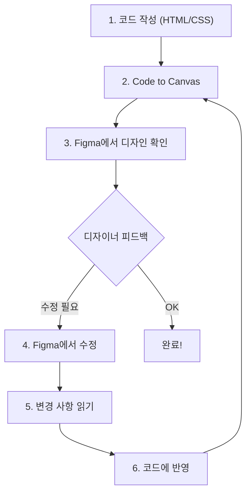

# Step 4: 라운드트립 워크플로우

> 디자인을 수정하고, 그 변경을 코드에 반영하는 전체 순환 과정을 배워봅시다

---

## 라운드트립이란?

편도(one-way)가 아닌 **왕복(round-trip)** 워크플로우입니다:

```
1단계: 코드 → Figma    (Code to Canvas)
2단계: Figma에서 수정    (디자이너 작업)
3단계: Figma → 코드     (변경 사항 읽기)
4단계: 코드 업데이트     (개발자 반영)

→ 다시 1단계로... (필요할 때마다 반복)
```

비유하면:

```
건축가(디자이너)           시공사(개발자)
    │                        │
    │   1. 시공 결과 도면에   │
    │      올려봄 (Canvas)    │
    │   ◀─────────────────   │
    │                        │
    │   2. "여기 패딩 좀      │
    │      더 주세요"         │
    │   ─────────────────▶   │
    │                        │
    │   3. 수정된 도면 읽기    │
    │   ◀─────────────────   │
    │                        │
    │   4. 코드에 반영         │
    │                        │
    └────── 반복 ────────────┘
```

---

## 실습: 카드 디자인 수정 → 코드 반영

### 시나리오

Step 3에서 Studio 카드를 Figma에 올렸습니다. 디자이너가 다음을 수정했다고 가정합니다:

- 카드 패딩: 20px → **24px**
- 제목 크기: 17.6px → **18px**
- 배지 모서리: 999px (원형) → **8px** (약간 둥근)
- 새로운 색상: 진행중 상태 = **#3B82F6** (파란색으로 변경)

### 1단계: Figma에서 변경 사항 읽기

```
> Figma 파일에서 "Studio Card" 프레임의 현재 스타일을 읽어줘.
> 이전 코드와 달라진 부분을 비교해줘.
> Figma: https://www.figma.com/design/YOUR_FILE_KEY/Studio-Cards
```

### 예상 응답

```
📋 변경 사항 분석:
━━━━━━━━━━━━━━━━━━━━━━━━━━━━━━━━━

| 속성           | 이전 (코드) | 현재 (Figma) | 변경 |
|----------------|-----------|-------------|------|
| 카드 패딩       | 20px      | 24px        | +4px |
| 제목 크기       | 17.6px    | 18px        | +0.4 |
| 배지 border-r   | 999px     | 8px         | 변경 |
| 진행중 색상      | #F59E0B   | #3B82F6     | 변경 |

적용할까요?
```

### 2단계: 코드에 반영

```
> 위 변경 사항을 studio-card.html에 반영해줘
```

### 예상 응답

```
✅ 4개 항목을 수정했습니다:

1. .project-card padding: 20px → 24px
2. .card__title font-size: 1.1rem → 18px
3. .card__badge border-radius: 999px → 8px
4. --color-in-progress: #F59E0B → #3B82F6

변경된 파일: examples/studio-card-to-figma/studio-card.html
```

### 3단계: 업데이트된 코드를 다시 Figma로

```
> 수정된 카드를 다시 Figma에 올려서 디자이너가 확인할 수 있게 해줘
```

이렇게 한 바퀴가 돕니다!

---

## 라운드트립의 실전 가치

### 전통적 워크플로우 vs 라운드트립

```
전통적 (5-7일):
─────────────────────────────────────
Day 1: 디자이너가 Figma에서 디자인
Day 2: 개발자가 눈으로 보고 코딩
Day 3: "이거 3px 틀렸어요" → 수정
Day 4: "색상이 다른데요" → 수정
Day 5: "간격이..." → 수정
Day 6-7: QA + 추가 수정

라운드트립 (1-2일):
─────────────────────────────────────
Day 1: 디자인 읽기 → 정확한 코드 생성
       → Canvas로 확인 → 즉시 피드백
       → 수정 반영 → 다시 확인
Day 2: QA + 미세 조정
```

### 핵심: 커뮤니케이션 비용 감소

```
수정 요청 횟수:
  전통적:    ████████████ 12회
  라운드트립: ███ 3회

이유: "눈으로 추측" 대신 "정확한 값을 읽고 쓰기" 때문
```

---

## 전체 워크플로우 요약



---

## 핵심 정리

| 개념 | 설명 |
|------|------|
| 라운드트립 | 코드 → 디자인 → 코드의 순환 워크플로우 |
| 변경 감지 | Figma의 현재 값과 코드를 비교 분석 |
| 자동 반영 | Claude가 차이점을 코드에 자동 적용 |
| 커뮤니케이션 비용 | 정확한 값 교환으로 수정 요청 횟수 감소 |

---

## 다음 단계

- [전체 실습 가이드](../examples/studio-card-to-figma/README.md) — 처음부터 끝까지 한번에 따라하기
- [프로젝트 메인](../README.md) — 전체 정리로 돌아가기
